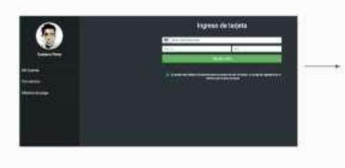
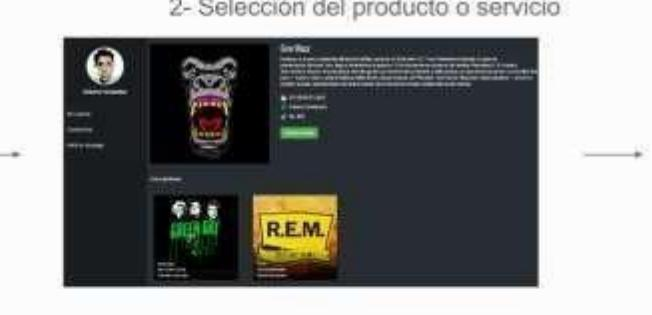
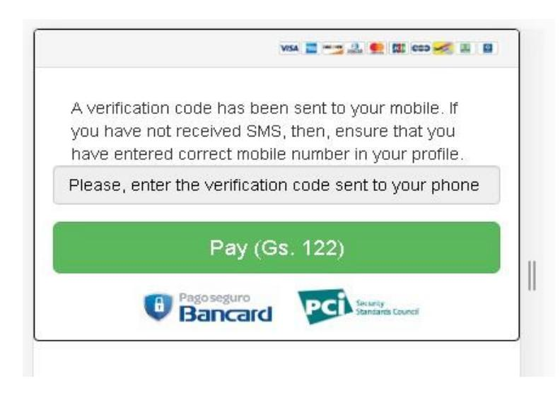
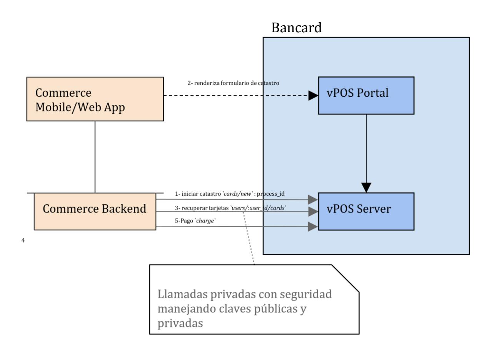
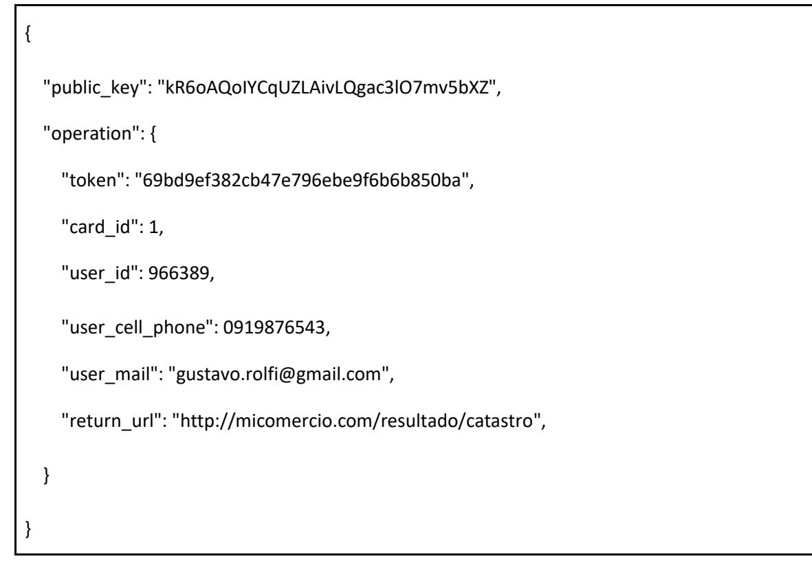
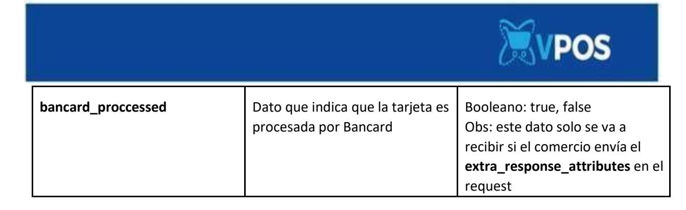
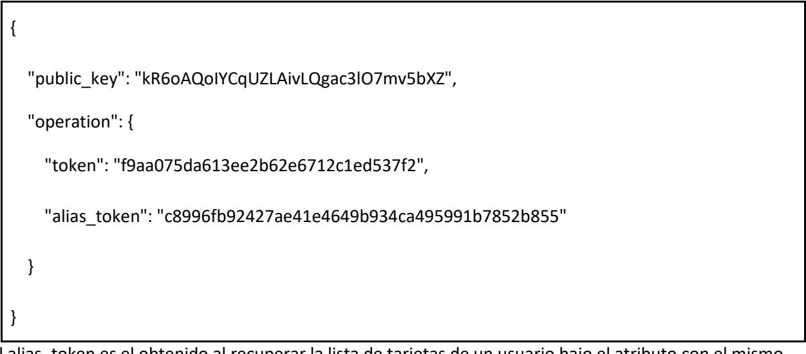
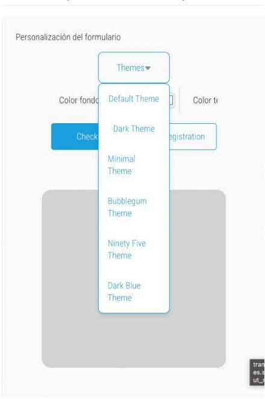

# VPOS 2.O

 **Colaborando para construir tu negocio en internet**

Especificaciones Técnicas Single Buy Versión 1.19


# Control de cambios

| Sección/hoja                    | Versión      | Fecha      | Descripción                                                                              |  |
|---------------------------------|--------------|------------|------------------------------------------------------------------------------------------|--|
| Pago ocasional/Pág. 8           | Versión 1.3  | 09/08/2018 | Se agrega sección "Tarjetas procesadas"                                                  |  |
| Pago con token/Pág. 18          | Versión 1.3  | 09/08/2018 | Se agrega sección "Tarjetas procesadas"                                                  |  |
| Pagos con débito                | Versión 1.3  | 09/08/2018 | Se elimina la sección de pagos con débito.                                               |  |
| Catastro de tarjeta/Pág.<br>26  | Versión 1.3  | 09/08/2018 | Se agrega la sección "Flujo de catastro"                                                 |  |
| Catastro de tarjeta/Pág.<br>27  | Versión 1.3  | 09/08/2018 | Se agrega "Recomendación para el comercio"                                               |  |
|                                 | Versión 1.4  | 18/09/2018 | Cambio de pago anónimo por pago ocasional                                                |  |
| Código de errores -Pag<br>50    | Versión 1.5  | 15/10/2018 | Anexo Código de errores                                                                  |  |
| Catastro de tarjeta – Pag<br>22 | Versión 1.6  | 14/01/2019 | Recomendación para el comercio.                                                          |  |
| Single Buy Zimple – Pag<br>17   | Versión 1.7  | 05/04/2019 | Integración Zimple-vPOS                                                                  |  |
|                                 | Version 1.8  | 30/08/2019 | Recomendación para aplicativos                                                           |  |
| Pag 51                          | Version 1.8  | 30/08/2019 | Paso a producción                                                                        |  |
| Pag 42                          | Version 1.9  | 11/09/2019 | Reversas operativas                                                                      |  |
| Pag 11                          | Version 1.10 | 25/08/2020 | Se agrega nueva funcionalidad del additional_data para<br>soportar múltiples promociones |  |
| Pag 21                          | Version 1.10 | 25/08/2020 | Se agrega datos de prueba de zimple                                                      |  |
|                                 | Versión 1.11 | 07/05/2021 | Agregar soporte para la Ley de Servicios Digitales                                       |  |


| Pag 10 – Flag<br>preautorizacion en<br>single buy<br>Pag 35 – Flag<br>preautorizacion en<br>charge<br>Pag 52 – Servicio nuevo<br>para confirmar una                                                                                                                                                                                                                                                                                                   | Version 1.12 | 21/05/2021 | Agregar preautorizacion                                                                                               |  |
|-------------------------------------------------------------------------------------------------------------------------------------------------------------------------------------------------------------------------------------------------------------------------------------------------------------------------------------------------------------------------------------------------------------------------------------------------------|--------------|------------|-----------------------------------------------------------------------------------------------------------------------|--|
| preautorizacion                                                                                                                                                                                                                                                                                                                                                                                                                                       |              |            |                                                                                                                       |  |
|                                                                                                                                                                                                                                                                                                                                                                                                                                                       | Version 1.13 | 11/01/2023 | Se quita el flujo de tet ya no valido para vpos                                                                       |  |
| Pag 33                                                                                                                                                                                                                                                                                                                                                                                                                                                | Version 1.14 | 28/08/2023 | Se agrega datos adicionales para el servicio de listar<br>tarjetas                                                    |  |
| Pag 65                                                                                                                                                                                                                                                                                                                                                                                                                                                | Versión 1.15 | 12/09/2023 | Se agrega flujo de Preautorizacion con TC y con TD                                                                    |  |
| Pag 39-40                                                                                                                                                                                                                                                                                                                                                                                                                                             | Version 1.16 | 21/03/2024 | Se agrega flujo para 3DS                                                                                              |  |
| Pág. 8                                                                                                                                                                                                                                                                                                                                                                                                                                                | Versión 1.17 | 07/10/2024 | Agrega soporte para TD local en Pago Ocasional                                                                        |  |
| Pág. 11                                                                                                                                                                                                                                                                                                                                                                                                                                               | Versión 1.17 | 07/10/2024 | Agrega parámetro "extra_response_attributes"                                                                          |  |
| Pág. 37                                                                                                                                                                                                                                                                                                                                                                                                                                               | Versión 1.17 | 16/12/2024 | Corrección del tiempo de espera de Operación de<br>confirmación                                                       |  |
| Pág. 63                                                                                                                                                                                                                                                                                                                                                                                                                                               | Versión 1.18 | 13/02/2025 | Mejoras visuales sobre los formularios de catastros y<br>pagos ocasionales.                                           |  |
| Pag. 12 – Flag billing<br>para single buy<br>Pág. 13-16 – Parámetros<br>de billing a enviar en<br>single buy<br>Pág. 22-24 – Parámetros<br>de billing a enviar en<br>single buy zimple<br>Pág. 37-39 – Parámetros<br>de billing a enviar en<br>pago con token<br>Pág. 45-47 – Parámetros<br>a recibir en responde de<br>pago ocasional y pago<br>con token<br>Pág. 66-71 –<br>Operaciones exclusivas<br>y consideraciones para<br>factura electrónica | Versión 1.19 | 10/07/2025 | Integración con Factura Electrónica                                                                                   |  |
| Pág. 39                                                                                                                                                                                                                                                                                                                                                                                                                                               | Versión 1.19 | 10/07/2025 | Se agrega aclaratoria con respecto al flujo de pago con<br>token para comercios del rubro Casinos y juegos de<br>azar |  |
| Pág. 72                                                                                                                                                                                                                                                                                                                                                                                                                                               | Versión 1.19 | 10/07/2025 | Agregadas aclaraciones con respecto a la operativa de<br>confirmación de preautorizaciones.                           |  |


### Contenido

<span id="page-3-0"></span>

| $\textbf{Contenido}\dots\ldots\ldots\ldots\ldots\ldots\ldots\ldots\ldots\ldots\ldots\ldots\ldots\ldots\$                                                                                                                                                                                                                                                                                                                                                                                                                                                                                                                                                                                               |  |
|--------------------------------------------------------------------------------------------------------------------------------------------------------------------------------------------------------------------------------------------------------------------------------------------------------------------------------------------------------------------------------------------------------------------------------------------------------------------------------------------------------------------------------------------------------------------------------------------------------------------------------------------------------------------------------------------------------|--|
| $Introduction \textbf{Introduction} \textbf{Introduction} \textbf{Function} \textbf{Function} \textbf{Function} \textbf{Function} \textbf{Function} \textbf{Function} \textbf{Function} \textbf{Function} \textbf{Function} \textbf{Function} \textbf{Function} \textbf{Function} \textbf{Function} \textbf{Function} \textbf{Function} \textbf{Function} \textbf{Function} \textbf{Function} \textbf{Function} \textbf{Function} \textbf{Function} \textbf{Function} \textbf{Function} \textbf{Function} \textbf{Function} \textbf{Function} \textbf{Function} \textbf{Function} \textbf{Function} \textbf{Function} \textbf{Function} \textbf{Function} \textbf{Function} \textbf{Function} \textbf$ |  |
| Autenticación                                                                                                                                                                                                                                                                                                                                                                                                                                                                                                                                                                                                                                                                                          |  |
| $Token\\$                                                                                                                                                                                                                                                                                                                                                                                                                                                                                                                                                                                                                                                                                              |  |
| Pago ocasional                                                                                                                                                                                                                                                                                                                                                                                                                                                                                                                                                                                                                                                                                         |  |
| $\textit{Operaciones pago ocasional} \textit{} \textit{} \textit{} \textit{} \textit{} \textit{} \textit{} \textit{} \textit{} \textit{} \textit{} \textit{} \textit{} \textit{} \textit{} \textit{} \textit{} \textit{} \textit{} \textit{} \textit{} \textit{} \textit{} \textit{} \textit{} \textit{} \textit{} \textit{} \textit{} \textit{} \textit{} \textit{} \textit{} \textit{} \textit{}$                                                                                                                                                                                                                                                                                                    |  |
| Single Buy (Pedido de pago)                                                                                                                                                                                                                                                                                                                                                                                                                                                                                                                                                                                                                                                                            |  |
| Single Buy Zimple (Pedido de pago con Zimple)                                                                                                                                                                                                                                                                                                                                                                                                                                                                                                                                                                                                                                                          |  |
| Catastro y Pago con token                                                                                                                                                                                                                                                                                                                                                                                                                                                                                                                                                                                                                                                                              |  |
| Operaciones para catastro y pago con token                                                                                                                                                                                                                                                                                                                                                                                                                                                                                                                                                                                                                                                             |  |
| Catastro de Tarjeta (Cards_new)                                                                                                                                                                                                                                                                                                                                                                                                                                                                                                                                                                                                                                                                        |  |


| Recuperar Tarjetas catastradas de un usuario (users_cards)                                             |  |
|--------------------------------------------------------------------------------------------------------|--|
| Pago con token(charge)                                                                                 |  |
| Flujo 3D SECURE Pago con token - Charge                                                                |  |
| Eliminar tarjeta                                                                                       |  |
| Operaciones comunes para pago ocasional y pago con token                                               |  |
| Buy Single Confirm (Operación de confirmación de una transaccion)                                      |  |
| Información índice de riesgos                                                                          |  |
| <table>          Single Buy Rollback (Operación de reversa de transacción)         49</table>          |  |
| Get Buy Single Confirmation(Operación de consulta de una transacción)                                  |  |
| Preauthorization Confirm(Operación de confirmación de una preautorización)                             |  |
| <table>          Operaciones Exclusivas con Facturas Electrónicas         66</table>                   |  |
| Get Client Info by RUC (Operación para obtener datos de cliente para Factura Electrónica)66            |  |
| Cancel Generated Invoice (Operación para cancelar Factura Electrónica)                                 |  |
| Flujo de una Preautorizacion:                                                                          |  |
| Flujo con Tarjeta de crédito:                                                                          |  |
| Observación:                                                                                           |  |
| Flujo con Tarjeta de débito:                                                                           |  |
| Observación:                                                                                           |  |
| Restricciones del comercio                                                                             |  |
| Solicitud de pase a producción                                                                         |  |
| Mejoras visuales sobre los formularios de catastros y pagos ocasionales                                |  |
| <table>          Transición de los formularios a los nuevos estilos</table>                            |  |
| Formulario de catastro                                                                                 |  |
| Formulario de pagos ocasionales                                                                        |  |
| Nuevas opciones de personalización                                                                     |  |
| Vista previa                                                                                           |  |
| $\textbf{Temas predefinidos \textbf{}\textbf{}\textbf{}\textbf{}\textbf{}\textbf{}\textbf{}\textbf{}\$ |  |
| $C\'odigo de errores - Vpos~2.081$                                                                     |  |

# <span id="page-4-0"></span>**Introducción**

El siguiente documento presenta la información técnica necesaria para comunicarse con el servicio de pasarela de pagos de eCommerce de Bancard o VPOS.


El producto por construir por el comercio podrá ser Web o Mobile. A continuación, se detallan las distintas interacciones con servicios de la API REST, así como redirecciones necesarias a una interfaz de Bancard para solicitar los datos de la tarjeta de crédito.

Adicionalmente a este documento el comercio o desarrollador de la integración con VPOS deberá contar con un acceso al portal de comercio de Bancard: [https://comercios.bancard.com.py](https://comercios.bancard.com.py/)

En el mismo se le brindará acceso para:

- Acceder al ambiente de staging y producción de vpos
- Acceder a la clave pública y privada. Adicionalmente podrá regenerar ambas claves.
- Modificar información del perfil: Nombre, logo y url de confirmación
- Traza de interacciones entre VPOS y el producto desarrollado por el comercio.
- Checklist con pasos para validar la integración.
- Documentación y ejemplos de códigos en distintos lenguajes.

| En la traza<br>pueden<br>verificar sus<br>projectas como<br>si fuera un log.<br>Se muestra lo<br>que et.<br>comercio envia<br>y lo que el<br>servicio<br>responde.<br>Claves.<br>para<br>invocar a<br>las APIS.<br>Aqui cargar<br>la uri de<br>confirmació<br>in y pueden.<br>personalizar<br>et iframe. |                                                                                                                                                                                                  |                                                                                                                                                                                                | Lista do test a<br>chequear, se marca<br>automaticamente<br>mientras van haciendo<br>pruebas.                                                                                                                                                                | Pestaña donde se encuenta<br>la documentación + tarjetas<br>de prueba. | Pestaña donde<br>realizan sus pruebas<br>de integración.                                                                                                                                                                                                     |
|----------------------------------------------------------------------------------------------------------------------------------------------------------------------------------------------------------------------------------------------------------------------------------------------------------|--------------------------------------------------------------------------------------------------------------------------------------------------------------------------------------------------|------------------------------------------------------------------------------------------------------------------------------------------------------------------------------------------------|--------------------------------------------------------------------------------------------------------------------------------------------------------------------------------------------------------------------------------------------------------------|------------------------------------------------------------------------|--------------------------------------------------------------------------------------------------------------------------------------------------------------------------------------------------------------------------------------------------------------|
|                                                                                                                                                                                                                                                                                                          | vPOS - Prueba Ecom O (78)                                                                                                                                                                        |                                                                                                                                                                                                |                                                                                                                                                                                                                                                              | Documentación                                                          | Staging<br>Producción                                                                                                                                                                                                                                        |
|                                                                                                                                                                                                                                                                                                          | Lists de tests<br>(POS 10<br>VP08.1.8<br>Traza de actividad<br>Caves<br>Perfil de adicación.<br>Correctos habilitados<br>Cliente de prostis.<br>(POSIO<br>(POSTA)<br>Clientes de<br>prueba donde | Permisos de staging<br>Ingreso de configuración del cliente<br>✓ Lm 10033-110<br>Ejecución de cliente de prueba<br>Implementación de pagos<br>X Reclair treación de pago<br>X Reclaic rollhack | Habital perform th access a stopped (1990283-114)<br>Companies presis saveaux-1231<br>Ut de commenciale DAMBOR-12-92<br>Cliente de prada rescutado - IZMORT-IZ-KT.<br>Confirmance correctamente al comercio<br>Rechimos pedido de confirmación del comercio. | TAXABABLE LINE<br><b>BITARON - THE</b><br>though the                   | Botón para solicitar la<br>certificación, el botón<br>se habilita al<br>momento de<br>chequear por<br>completo la lista de<br>test. Al solicitar un<br>equipo de soporte<br>realiza pruebas en el<br>sitio del comercio para<br>verificar su<br>integración. |
|                                                                                                                                                                                                                                                                                                          | pueden simular<br>el uso de las<br>APIS.                                                                                                                                                         |                                                                                                                                                                                                | Deberás ingresar información de contacto para sollicitar al pase a producción.                                                                                                                                                                               |                                                                        |                                                                                                                                                                                                                                                              |

El vPOS 2.0 cuenta con dos formas de pago, que son los siguiente:

1- **Pago ocasional**: El usuario carga siempre todos los datos de su tarjeta en el formulario realizando así el pago.

*Servicios ofrecidos:* 


- **single\_buy**  inicia el proceso de pago.
- 2- **Pago con token**: El usuario catastra su tarjeta y realiza el pago con un click. *Servicios ofrecidos:* 
  - **Cards\_new**  Inicia el proceso de catastro de una tarjeta.
  - **Users\_cards**  operación que permite listar las tarjetas catastradas por un usuario.
  - **Charge**  operación que permite el pago con un token.
  - **Delete**  operación que permite eliminar una tarjeta catastrada.

### *Servicios que se utilizan tanto para pago ocasional como para pago con token:*

- **single\_buy\_rollback**  operación que permite cancelar el pago (ocasional o con token).
- **get\_single\_buy\_confirmation**  operación para consulta, si un pago (ocasional o con token) fue confirmado o no.

### *Servicios ofrecidos por el comercio*

- **single\_buy\_confirm** - operación que será invocada por VPOS para confirmar un pago (ocasional o con token).

El cliente debe ofrecer en una URL pública y de común acuerdo un servicio mediante el cual se notificará la aprobación o cancelación de la transacción de un cliente final, además para funcionar como cliente Web Service de vPOS deberían soportar TLS1. 2..

# <span id="page-6-0"></span>**Autenticación**

La clave privada y pública permitirán identificar todas las interacciones con los servicios del eCommerce de Bancard. Estas claves serán enviadas por el producto desarrollado por el comercio en todas sus peticiones para identificarse (la clave privada **nunca** viaja en forma plana, sino *hasheada* con otra información en forma de *token*). Ambas pueden ser generadas nuevamente en caso de vulneración.

La clave pública **será única**, y de la forma: [a-zA-Z0-9] {32}. La clave privada no tiene porqué ser única (aunque seguramente lo sea), y de la forma: [a-zA-Z0-9T1] {40}.

# **Peticiones realizadas por el comercio a VPOS**

Las peticiones serán realizadas por POST a una interfaz REST

| public_key | Clave pública del comercio. |
|------------|-----------------------------|


| operation |  |  |
|-----------|--|--|
|           |  |  |

**operation** Datos de la operación que se va a llevar a cabo.

"public\_key": "[public key]", "operation": { "token": "[generated token]",

} }

...

{

#### <span id="page-7-0"></span>**Token**

El token será generado al momento de realizar la petición, dependiendo de la operación. Será siempre un md5 (32 caracteres). El orden debe ser exactamente como se indica.

```
 single buy 
            md5(private_key + shop_process_id + amount + currency) 
            single_buy confirm 
            md5(private_key + shop_process_id + "confirm" + amount + currency) 
            single_buy get confirmation 
            md5(private_key + shop_process_id + "get_confirmation") 
            single buy rollback 
            md5(private_key + shop_process_id + "rollback" + "0.00")
```

El token de confirm para una acción de rollback se genera usando "0.00" para amount. Al momento de generar el token, los números deben ser transformados en cadenas, usar dos dígitos decimales y un punto (".") como separador de decimales. ej.:

token = md5("[private key]" + "3332134" + "130.00" + "130.00")

#### **cards\_new**

md5(private\_key + card\_id + user\_id + "request\_new\_card")

# **users\_cards**

md5(private\_key + user\_id + "request\_user\_cards")

# **charge**

md5(private\_key + shop\_process\_id + "charge" + amount + currency +alias\_token)


# **delete** md5(private\_key + "delete\_card" + user\_id + card\_token)

### <span id="page-8-0"></span>**Pago ocasional**

Tarjetas procesadas

Esta operación acepta todas las tarjetas.

El comercio carga el iframe de pago seguro de Bancard en su sitio, donde el iframe de pago ocasional queda totalmente integrado sin necesidad de que el cliente salga del sitio del comercio.

| Supermercado O'Lujo           | Sonos Productos Terretto Astronite Contacto                                                                                                                                                                                                                                                                                                             |                                                       |
|-------------------------------|---------------------------------------------------------------------------------------------------------------------------------------------------------------------------------------------------------------------------------------------------------------------------------------------------------------------------------------------------------|-------------------------------------------------------|
| Cocma<br>land m<br>Docwitoria | Silla de cocina<br><b>NGS</b><br>Silla de comedor color bianco. No se deforma, no se decolora-<br>Medida: 384 x 1,000 x 448mm. Soporta hasta 100Kg. Gackritia de<br>por vida.<br>$n = n - 4$ (Letterlay<br>💨 coo 🛹 🌁 📟 🔤 visa<br>1000000000000000000000000000000000000<br>AMATTE:<br>l ove<br>Installments (only for Paraguage).<br>$\mathbf{v}^{\ast}$ | Sitio del<br>comercio<br>Iframe<br>de pago<br>anonimo |
|                               | Pay (Gs. 301.004)<br>Bancard Ci                                                                                                                                                                                                                                                                                                                         |                                                       |
|                               | Comentarios.<br>Silla de muy buena calidad, regocio 100% recomendatrelli<br>Romado per Represe al 2022<br><b>Bear un comentano</b>                                                                                                                                                                                                                      |                                                       |
|                               | Copyright © Supermentado D'Lujo 2018                                                                                                                                                                                                                                                                                                                    |                                                       |

#### <span id="page-8-1"></span>**Operaciones pago ocasional**

El eCommerce de Bancard cuenta con operaciones publicadas como Web Services REST disponibles para los comercios asociados que le permitirán realizar el flujo de un carrito en su sitio.

#### <span id="page-8-2"></span>**Single Buy (Pedido de pago)**

**POST** {environment}/vpos/api/0.3/single\_buy

Environment:

● **Producción** - https://vpos.infonet.com.py


● **Staging** - https://vpos.infonet.com.py:8888

Token: md5(private\_key + shop\_process\_id + amount + currency)

### **Operación invocada por el comercio para iniciar el proceso de pago.**

Este servicio devolverá un identificador de proceso (process id) que se utilizará para invocar el iframe de pago ocasional. Llamamos **iframe de pago ocasional** al iframe que permite cargar el formulario en el sitio del comercio.

# **Debe completarse con éxito un Single Buy para habilitación de la correspondiente opción en la Lista de test ->Recibir creación de pago**

Obs1: **No** se marcará en la lista de test si es que en el json del pedido envían test\_client.

Obs2: Si el comercio ya cuenta con el vPOS 1.0 esta operación ya lo tiene implementada, solo deben cambiar el redirect por el iframe de pago ocasional.

### **El pedido estará compuesto por un JSON con los siguientes elementos:**

### Elementos de la petición

| public_key | Clave pública.     | String (50) |
|------------|--------------------|-------------|
| operation  | Elemento Operation | Operation   |

# Elementos Operation

| token           | md5 de la petición          | String (32) |
|-----------------|-----------------------------|-------------|
| shop_process_id | identificador de la compra. | Entero (15) |


| amount           | Importe en guaraníes.                                                                                                                                    | Decimal (15,2)<br>-<br>separador decimal '.' |
|------------------|----------------------------------------------------------------------------------------------------------------------------------------------------------|----------------------------------------------|
| iva_amount       | Importe en guaraníes.<br>Este parámetro aplica solo<br>para aquellos comercios que<br>deben cumplir con la "Ley de<br>servicios digitales"               | Decimal (15,2)<br>-<br>separador decimal '.' |
| currency         | Tipo de Moneda.                                                                                                                                          | String (3) -<br>PYG (Gs)                     |
| additional_data  | Campo<br>de<br>servicio<br>de<br>uso<br>reservado para casos especiales.<br>Opcional                                                                     | String (100)                                 |
| preauthorization | Campo opcional para indicar que<br>es una preautorizacion                                                                                                | String (1) : S                               |
| description      | Descripción del pago, para<br>mostrar al usuario.                                                                                                        | String (20)                                  |
| return_url       | URL a donde se enviará al<br>usuario al realizar el pago. Tener<br>en cuenta que, si la tarjeta es<br>rechazada, también se le<br>redirigirá a esta URL. | String (255)                                 |
| cancel_url       | URL a donde se enviará al<br>usuario al cancelar el pago.<br>Opcional, se usará return_url<br>por defecto.                                               | String (255)                                 |


| extra_response_attributes | Parámetros para recibir datos<br>extras en la respuesta del<br>servicio. |                                                                                           |
|---------------------------|--------------------------------------------------------------------------|-------------------------------------------------------------------------------------------|
|                           |                                                                          | Devuelve "credit" o "debit".<br>debit: Es una tarjeta de débito<br>procesada por Bancard. |
|                           |                                                                          | credit: Es una tarjeta de crédito<br>o una tarjeta no procesada por<br>Bancard.           |
| billing                   | Campo reservado para enviar<br>información de facturación.<br>Opcional   | Billing                                                                                   |

# Descripción de "additional\_data"

Este elemento será utilizado para enviar información adicional a validar en el momento de la autorización de la compra. Se empleará para indicar promociones o convenios realizados entre el comercio, Bancard y el emisor.

La estructura de este elemento será:

| Dato     | Tipo de<br>Dato | Formato                                | Posición | Alcance | Ejemplo |
|----------|-----------------|----------------------------------------|----------|---------|---------|
| Entidad  | Int (3)         | Rellenado con ceros a la<br>izquierda  | 1-3      | TC y TD | 099     |
| Marca    | String (3)      | Rellenado con espacios a la<br>derecha | 4-6      | TC y TD | 'VS'    |
| Producto | String (3)      | Rellenado con espacios a la<br>derecha | 7-9      | TC y TD | 'ORO'   |


| Afinidad | Int (6) | Rellenado con ceros a la<br>izquierda | 10-15 | TC | 000045 |
|----------|---------|---------------------------------------|-------|----|--------|
|----------|---------|---------------------------------------|-------|----|--------|

Ejemplo de datos a enviar si el comercio desea validar que:

- . la tarjeta sea de una entidad específica: 099
- . la tarjeta sea de una entidad y afinidad específica: 099 000045
- . la tarjeta sea de una entidad y marca específica: 099VS
- . la tarjeta sea de una entidad, marca y producto específico: 099VS ORO
- . la tarjeta sea de una marca específica: 000VS

.se puede enviar varias promociones: 099VS ORO000045,099VS,099VS ORO000045 \*entre comas(,) sin espacio

### Consideraciones a tener en cuenta para integrar Factura Electrónica

- El comercio debe estar habilitado para emitir Factura Electrónica.
- El campo del Timbrado (commerce\_stamp) debe ser válido.
- Los campos de Establecimiento (commerce\_establishment) y Punto de Expedición (commerce\_expedition\_point) deben corresponder al Timbrado enviado.
- Si el valor del RUC del cliente (client\_ruc) es distinto a nulo o vacío, los valores del nombre (client\_name) y correo electrónico (client\_email) también deben ser distinto a nulo o vacío.
- Si el valor del RUC del cliente (client\_ruc) es igual a nulo o vacío, se considerará como una Factura Innominada.
- Las facturas innominadas solo pueden ser generadas hasta un valor de Gs 7.000.000, según reglamentación de la DNIT.
- La lista de ítems adquiridos (details) no puede estar vacía.
- El costo total de los ítems en operation.billing.details debe coincidir con el monto enviado en operation.amount.
- La factura electrónica será emitida si y solo si los datos de facturación enviados son válidos y el pago ha sido confirmado correctamente.
- En el flujo de pre-autorizacion, la factura electrónica se genera luego de la confirmación de la transacción.
- En caso de que los datos de facturación enviados no sean válidos, se emitirá un mensaje de error detallando el problema, y no se procesará el pago.


- En caso de que los datos de facturación sean válidos, el pago se procese sin inconvenientes, pero la factura electrónica no se haya podido generar correctamente, se emitirá un mensaje detallando el problema con la facturación en el campo billing\_response. El pago se mantendrá en estado procesado.
- Los datos de todas las facturas electrónicas emitidas estarán disponibles en el portal de facturación electrónica para ser consultadas.
- Si ha ocurrido un problema con la facturación, el comercio tendrá la opción de volver a generar la factura desde el portal de facturación electrónica.

# Descripción de elemento Billing

Este elemento será utilizado para enviar la información de facturación del comercio. Los datos recibidos serán utilizados para emitir una factura electrónica, si es que el comercio está habilitado para hacerlo. Debe tener en cuenta ciertas consideraciones para la integración correcta de este elemento.

La estructura de este elemento será:

| client_ruc                | RUC del Cliente                      | String (15)<br>Obs: Si se envía null se emitirá<br>una factura innominada |  |
|---------------------------|--------------------------------------|---------------------------------------------------------------------------|--|
| client_name               | Nombre o Razón Social del<br>Cliente | String (100)                                                              |  |
| client_email              | Correo electrónico del Cliente       | String (32)                                                               |  |
| commerce_stamp            | Timbrado                             | String (32)                                                               |  |
| commerce_expedition_point | Punto de Expedición                  | String (32)                                                               |  |
| commerce_establishment    | Establecimiento                      | String (32)                                                               |  |


Elemento Details:

| description | Descripción<br>del articulo<br>adquirido  | String (255)                                 |
|-------------|-------------------------------------------|----------------------------------------------|
| amount      | Precio unitario del articulo<br>adquirido | Decimal (15,2)<br>-<br>separador decimal '.' |
| iva_rate    | Tasa de IVA aplicada al<br>producto.      | Entero (15)                                  |
| total_items | Cantidad del mismo artículo<br>adquirido  | Entero (15)                                  |

**Ejemplo petición**:

| {                                              |
|------------------------------------------------|
| "public_key": "[public key]",                  |
| "operation": {                                 |
| "token": "[generated token]",                  |
| "shop_process_id": 54322,                      |
| "currency": "PYG",                             |
| "amount": "10330.00",                          |
| "iva_amount": "1033.00",                       |
| "additional_data": "099VS ORO000045",          |
| "description": "Ejemplo de pago",              |
| "return_url": "http://www.example.com/finish", |
| "cancel_url": "http://www.example.com/cancel", |
| "billing": {                                   |
| "client_ruc": "123456-1",                      |
| "client_name": "JUAN GONZALEZ",                |
| "client_email": "juangonzalez@mail.com.py",    |
| "commerce_stamp": "12559969",                  |
| "commerce_expedition_point": "001",            |
| "commerce_establishment": "002",               |
| "details": [                                   |
|                                                |


|   |   |   |   | {<br>}, | "description": "item 1",<br>"amount": "10000.00",<br>"iva_rate": 10,<br>"total_items": 1 |
|---|---|---|---|---------|------------------------------------------------------------------------------------------|
|   |   |   |   | {       | "description": "item 2",<br>"amount": "330.00",<br>"iva_rate": 10,<br>"total_items": 1   |
| } | } | } | ] | }       |                                                                                          |

**La respuesta estará compuesta por un JSON con los siguientes elementos:** 

| status     | Estado de respuesta        | String (20) |
|------------|----------------------------|-------------|
| process_id | Identificador de la compra | String (20) |

# **Ejemplo respuesta:**

}

{ "status": "success", "process\_id": "i5fn\*lx6niQel0QzWK1g"

**Nota:** 


"El mensaje de respuesta se enviará en el cuerpo (body) de la petición HTTP"

# *Invocar al iframe de pago ocasional*

Una vez obtenido el **process\_id en la operación de single\_buy**, el usuario podrá incluir en su e-commerce un formulario de checkout embebido, de esta forma la compra se podrá finalizar en su propia aplicación. Para esto podrá utilizar la librería JavaScript como se indica en el siguient[e](https://github.com/Bancard/bancard-checkout-js) [repositorio de](https://github.com/Bancard/bancard-checkout-js) [código.](https://github.com/Bancard/bancard-checkout-js) https://github.com/Bancard/bancard-checkout-js

El JavaScript para iframe de pago ocasional se encuentra publicado:

# src="**https://{enviroment}/checkout/javascript/dist/bancard-checkout-4.0.0.js">**

Environment

- **Producción**  https://vpos.infonet.com.py
- **Staging**  https://vpos.infonet.com.py:8888

```
Para levantar el iframe:
 window. onload = function () 
           {
```

Bancard.Checkout. createForm ('iframe-container', **process\_id** ', styles);

};

<span id="page-16-0"></span>Ejemplo de código html


| DOCTYPE html                                                                                                                                                                                                                                                                                                                                                                                                                                                                                                                                                                                    |
|-------------------------------------------------------------------------------------------------------------------------------------------------------------------------------------------------------------------------------------------------------------------------------------------------------------------------------------------------------------------------------------------------------------------------------------------------------------------------------------------------------------------------------------------------------------------------------------------------|
| <html lang="en"></html>                                                                                                                                                                                                                                                                                                                                                                                                                                                                                                                                                                         |
| <head></head>                                                                                                                                                                                                                                                                                                                                                                                                                                                                                                                                                                                   |
| <meta charset="utf-8"/>                                                                                                                                                                                                                                                                                                                                                                                                                                                                                                                                                                         |
| <title>iFrame</title>                                                                                                                                                                                                                                                                                                                                                                                                                                                                                                                                                                           |
| <script src="https://vpos.infonet.com.py:8888/checkout/javascript/dist/bancard&lt;br&gt;checkout-1.0.0.js"></script>                                                                                                                                                                                                                                                                                                                                                                                                                                                                            |
|                                                                                                                                                                                                                                                                                                                                                                                                                                                                                                                                                                                                 |
| <script type="application/javascript"> styles = {</td></tr><tr><td>"form-background-color": "#001b60",</td></tr><tr><td>"button-background-color": "#4faed1",</td></tr><tr><td>"button-text-color": "#fcfcfc",</td></tr><tr><td>"button-border-color": "#dddddd",</td></tr><tr><td>"input-background-color": "#fcfcfc",</td></tr><tr><td>"input-text-color": "#111111",</td></tr><tr><td>"input-placeholder-color": "#111111"</td></tr><tr><td>};<br>window. onload = function () {<br>Bancard.Checkout.createForm ('iframe-container', 'WR-YY9JmxsEZV3hpVGA7', styles);<br>};<br></script><br> |

# Panel de personalización

Pueden personalizar el iframe también por medio de una tabla de personalización que se encuentra en el panel de vpos del portal de comercio en el apartado de Perfil de la aplicación.


| Atributo                       | Valor                        |
|--------------------------------|------------------------------|
| Color fondo de campos          |                              |
| Color texto de campos          |                              |
| Color borde de campos          | $\qquad \qquad \blacksquare$ |
| Color fondo del botón          |                              |
| Color texto del botón          |                              |
| Color borde del botón          |                              |
| Color fondo de formulario      |                              |
| Color del borde del formulario | $\qquad \qquad \blacksquare$ |
| Color fondo de encabezado      |                              |
| Color texto de encabezado      |                              |
| Color de línea separadora      |                              |
| Color del placeholder          |                              |
| Color texto de tu-eres-tu      |                              |

**Luego de que el usuario ingrese los datos de su tarjeta y le da al botón de PAGAR, entonces el vpos realiza un POST a la url de confirmación que el comercio proporciono en el panel de la aplicación.** 

Es la siguiente operación: Operación de confirmación

Experiencia de compra de un cliente en un sitio con el **iframe de pago ocasional**







# <span id="page-19-0"></span>**Single Buy Zimple (Pedido de pago con Zimple)**

**POST** {environment}/vpos/api/0.3/single\_buy

Environment:

- Producción https://vpos.infonet.com.py
- Staging https://vpos.infonet.com.py:8888

Token: md5(private\_key + shop\_process\_id + amount + currency)

Operación invocada por el comercio para iniciar el proceso de pago por zimple. Es el mismo servicio que se utiliza para el pago ocasional.

Este servicio devolverá un identificador de proceso (process id) que se utilizará para invocar el iframe de zimple. Llamamos **iframe de pago zimple** al iframe que permite cargar el formulario en el sitio del comercio.

Obs: Si tiene implementado el pago ocasional, para implementar **Zimple**, solo tiene 2 variantes, el **additional\_data** y el campo **zimple**.

**El pedido estará compuesto por un JSON con los siguientes elementos:** 


### Elementos de la petición

| public_key | Clave pública.     | String (50) |
|------------|--------------------|-------------|
| operation  | Elemento Operation | Operation   |

#### Elementos Operation

| token           | md5 de la petición                                             | String (32)                                  |
|-----------------|----------------------------------------------------------------|----------------------------------------------|
| shop_process_id | identificador de la compra.                                    | Entero (15)                                  |
| amount          | Importe en guaraníes.                                          | Decimal (15,2)<br>-<br>separador decimal '.' |
| currency        | Tipo de Moneda.                                                | String (3) -<br>PYG (Gs)                     |
|                 |                                                                |                                              |
| additional_data | Campo donde ira el teléfono<br>celular del usuario con Zimple. | String (100)<br>Ej: "0981123456"             |
| description     | Descripción del pago, para<br>mostrar al usuario.              | String (20)                                  |


| cancel_url | URL a donde se enviará al<br>usuario al cancelar el pago.<br>Opcional, se usará return_url<br>por defecto. | String (255) |
|------------|------------------------------------------------------------------------------------------------------------|--------------|
| billing    | Campo reservado para enviar<br>información de facturación.<br>Opcional                                     | Billing      |

| zimple | Valor que enviar cuando se<br>quiere invocar el iframe de<br>simple, enviar "S" | String (1) Ej: "S" |
|--------|---------------------------------------------------------------------------------|--------------------|
|        |                                                                                 |                    |

# Descripción de elemento Billing

Este elemento será utilizado para enviar la información de facturación del comercio. Los datos recibidos serán utilizados para emitir una factura electrónica, si es que el comercio está habilitado para hacerlo. Debe tener en cuenta ciertas consideraciones para la integración correcta de este elemento.

La estructura de este elemento será:

| client_ruc     | RUC del Cliente                      | String (15)<br>Obs: Si se envía null se emitirá<br>una factura innominada |
|----------------|--------------------------------------|---------------------------------------------------------------------------|
| client_name    | Nombre o Razón Social del<br>Cliente | String (100)                                                              |
| client_email   | Correo electrónico del Cliente       | String (32)                                                               |
| commerce_stamp | Timbrado                             | String (32)                                                               |


| commerce_expedition_point | Punto de Expedición          | String (32)      |
|---------------------------|------------------------------|------------------|
|                           |                              |                  |
| commerce_establishment    | Establecimiento              | String (32)      |
|                           |                              |                  |
| details                   | Detalles de ítems adquiridos | Array de Details |
|                           |                              |                  |

#### Elemento Details:

| description | Descripción del articulo<br>adquirido     | String (255)                                 |
|-------------|-------------------------------------------|----------------------------------------------|
| amount      | Precio unitario del articulo<br>adquirido | Decimal (15,2)<br>-<br>separador decimal '.' |
| iva_rate    | Tasa de IVA aplicada al<br>producto.      | Entero (15)                                  |
| total_items | Cantidad del mismo artículo<br>adquirido  | Entero (15)                                  |

**Ejemplo petición:**


```
{
 "public_key": "[public key]",
 "operation": {
 "token": "[generated token]",
 "shop_process_id": 54322,
 "currency": "PYG",
 "amount": "10330.00",
 "additional_data": "0981123456",
 "description": "Ejemplo de pago",
 "return_url": "http://www.example.com/finish",
 "cancel_url": "http://www.example.com/cancel",
 "zimple": "S",
 "billing": {
 "client_ruc": "123456-1",
 "client_name": "JUAN GONZALEZ",
 "client_email": "juangonzalez@mail.com.py",
 "commerce_stamp": "12559969",
 "commerce_expedition_point": "001",
 "commerce_establishment": "002",
 "details": [
 {
 "description": "item 1",
 "amount": "10000.00",
 "iva_rate": 10,
 "total_items": 1
 },
 {
 "description": "item 2",
 "amount": "330.00",
 "iva_rate": 10,
 "total_items": 1
 }
 ]
 }
 }
}
```

**La respuesta estará compuesta por un JSON con los siguientes elementos:** 


| status     | Estado de respuesta        | String (20) |
|------------|----------------------------|-------------|
| process_id | Identificador de la compra | String (20) |

### **Ejemplo respuesta:**

```
{ 
"status": "success", 
"process_id": "i5fn*lx6niQel0QzWK1g" 
}
```

#### **Nota:**

"El mensaje de respuesta se enviará en el cuerpo (body) de la petición HTTP"

# *Invocar al iframe de pago con zimple*

Una vez obtenido el **process\_id**, el usuario podrá incluir en su e-commerce un formulario de checkout embebido, de esta forma la compra se podrá finalizar en su propia aplicación.

El JavaScript para iframe de pago con zimple se encuentra publicado:

```
src="https://{enviroment}/checkout/javascript/dist/bancard-checkout-3.0.0.js">
```

Environment

- Producción https://vpos.infonet.com.py
- Staging https://vpos.infonet.com.py:8888

# Para levantar el iframe:

```
window. onload = function () {
```

Bancard.Zimple.createForm ('iframe-container', **process\_id** ', styles);

};

[Ejemplo de código html](#page-16-0) [Ejemplo de código html](#page-16-0)


### **Ejemplo de iframe Zimple**



#### **Flujo para pago con Zimple**

- Enviar el pedido de single\_buy con las variantes para Zimple.
- El servicio enviará un código al teléfono cargado en el campo additional\_data.
- Levantar el iframe Zimple.
- El usuario debe cargar el código que llego a su teléfono en el iframe.
- Al confirmar el pago se debitará de su billetera Zimple.

# **Obs: El teléfono de prueba es 0981123456 y el código OTP para las pruebas es 1234 para una transaccion aprobada.**

**Luego de que el usuario ingrese los datos de su tarjeta y le da al botón de PAGAR, entonces el vpos realiza un POST a la url de confirmación que el comercio proporciono en el panel de la aplicación.** 

Es la siguiente operación: Buy Single [Confirm \(Operación de confirmación de una transaccion\)](#page-42-1)

# <span id="page-25-0"></span>**Catastro y Pago con token**

Esta es una opción totalmente nueva para el comercio, donde se puede catastrar una tarjeta y realizar el pago con el token generado en el catastro.

Vpos 2.0 contará con la opción de catastro de tarjetas dentro de un **iframe de catastro** siempre en el ambiente seguro de Bancard cumpliendo con las normas PCI.

Tarjetas procesadas

Esta operación acepta:


- Tarjetas de crédito local/internacional.
- Tarjeta de débito local/internacional.

#### Arquitectura planteada

Se plantea un e-commerce genérico con un backend (Commerce Backend), frontend web (Commerce Web App) y mobile (Commerce Mobile App). Los comercios pueden acceder a la API Rest de vPOS (vPOS Service) y al portal de vPOS (vPOS Portal) ambos dos instalados en Bancard cumpliendo las normas PCI.



#### <span id="page-26-0"></span>**Operaciones para catastro y pago con token**

### <span id="page-26-1"></span>**Catastro de Tarjeta (Cards\_new)**

**POST** {environment}/vpos/api/0.3/cards/new

Environment:

- **Producción**  https://vpos.infonet.com.py
- **Staging**  https://vpos.infonet.com.py:8888


Token:

md5(private\_key + card\_id + user\_id + "request\_new\_card")

Operación invocada por el comercio para iniciar el proceso de catastro.

Este servicio devolverá un identificador de proceso (process id) que se utilizará para invocar el iframe de catastro. Llamamos **iframe de catastro** al iframe que permite generar un token de tarjeta para pagos con un click.

**Debe completarse con éxito un Cards\_new para habilitación de la correspondiente opción en la Lista de test -> Solicitud de catastro**

Obs: No se marcará en la lista de test si es que en el json del pedido envían test\_client.

## **El pedido estará compuesto por un JSON con los siguientes elementos:**

Elementos de la petición

| public_key | Clave pública.     | String (50) |
|------------|--------------------|-------------|
| operation  | Elemento Operation | Operation   |

### Elementos Operation

| token           | md5 de la petición                         | String (32)  |
|-----------------|--------------------------------------------|--------------|
| card_id         | identificador de la tarjeta del<br>usuario | Entero (19)  |
| user_id         | Identificador del usuario                  | Entero (19)  |
| user_cell_phone | Teléfono del usuario                       | String (255) |


| user_mail  | Mail del usuario                                                                                                                                         | String (255) |
|------------|----------------------------------------------------------------------------------------------------------------------------------------------------------|--------------|
| return_url | URL a donde se enviará al<br>usuario al realizar el pago. Tener<br>en cuenta que, si la tarjeta es<br>rechazada, también se le<br>redirigirá a esta URL. | String (255) |

**Los atributos card\_id, user\_id, user\_cell\_phone y user\_mail son obligatorios y son brindados para asociar el pedido de catastro de tarjeta a un usuario con una referencia interna del comercio.** 

**Un usuario del comercio(user\_id) pueden tener N tarjetas asociadas(card\_id).** 

### **Ejemplo petición:**



**La respuesta estará compuesta por un JSON con los siguientes elementos:** 


| status     | Estado de respuesta        | String (20) |
|------------|----------------------------|-------------|
| process_id | Identificador de la compra | String (20) |

### **Ejemplo respuesta:**

{ "status": "success", "process\_id": "i5fn\*lx6niQel0QzWK1g" }

**Obs: Tener en cuenta que el servicio podría devolver algún dato adicional a futuro.**

### *Invocar al iframe de catastro de tarjeta*

El usuario podrá embeber dentro de su propio sitio o app un formulario para el ingreso de información sensible de tarjetas.

Una vez que se tiene el process\_id los pasos para realizar la integración son:

- 1. Incluir bancard-checkout.js
- 2. Iniciar contenedor con código JavaScript

# *1. Incluir bancard-checkout.js*

Para utilizar la librería *bancard-checkout.js* se debe incluir la misma utilizando, por ejemplo, el siguiente código:

El JavaScript para iframe de catastro se encuentra publicado:

https://github.com/Bancard/bancard-checkout-js

src="**https://{enviroment}/checkout/javascript/dist/bancard-checkout-4.0.0.js**">

Environment

- **Producción**  https://vpos.infonet.com.py
- **Staging**  https://vpos.infonet.com.py:8888

# *2. Iniciar contenedor con código JavaScript*


Para montar el formulario de catastro en el sitio web, se debe ejecutar Bancard.Cards.createForm indicando el id del contenedor, process\_id y un conjunto de opciones que incluyen los estilos asociados al elemento embebido.

Ejemplo de invocación:

window. onload = function () { Bancard.Cards.createForm('iframe-container','[PROCESS\_ID]', styles); };

[Ejemplo de código html](#page-16-0)

### *Recomendación para aplicativos que implementen catastro de tarjetas*

Para comercios que implementen en su aplicativo Android tener en cuenta que para implementar el iframe se tiene que agregar las siguientes líneas de código.

CookieSyncManager.getInstance().startSync();

CookieManager cookieManager = CookieManager.getInstance();

cookieManager.setAcceptCookie(true);

CookieManager.getInstance().setAcceptThirdPartyCookies(registrarTarjetaWebView, true);

Esto es porque para el iframe necesitamos en algunas situaciones aceptar cookies y si no se tiene seteado para aceptarlas entonces el aplicativo rechaza.

Obs1: En IOS aplicativos no existe ese inconveniente.

Obs2: En Safari a partir de cierta versión se controla mediante una opción ("Prevent cross-site tracking.") que no se pueda setear cookies desde un iFrame, en el navegador se encuentra esa opción, si desmarcan eso de su navegador ya no se da el inconveniente. Chrome también tiene esa opción, pero no viene marcado por defecto.

# **Flujo de catastro**

# **Para el catastro con tarjeta de crédito:**

- Se cargan los datos de la tarjeta (nro., fecha de expiración, cvv) - Se carga cedula

# **Para el catastro con tarjeta de débito:**


- Se cargan los datos de la tarjeta (no, fecha de expiración, dato adicional) - Se carga cedula

Al momento de levantar el iframe, les aparece la opción de cargar los datos de la tarjeta y al dar siguiente les pedirá cargar un numero de cedula valido.

La cedula válida para las tarjetas es: 9661000 (Para las pruebas)

# **Mensajes de respuesta del iframe de catastro**

- El mensaje del iframe si se cargan correctamente los datos de la tarjeta:

{ "status": " add\_new\_card\_success ", "description": null }

- El mensaje del iframe si no se carga correctamente los datos:

{ "status": " add\_new\_card\_fail ", "description": "No se ha catastrado la tarjeta. Para continuar con el catastro favor comuníquese con el CAC de Bancard. \*288/4161000" }

<span id="page-31-0"></span>**Recuperar Tarjetas catastradas de un usuario (users\_cards) POST** {environment}/vpos/api/0.3/users/**user\_id**/cards

Environment:

- **Producción**  https://vpos.infonet.com.py
- **Staging**  https://vpos.infonet.com.py:8888

Token:

md5(private\_key + user\_id + "request\_user\_cards")


**Operación invocada por el comercio para obtener las tarjetas catastradas de un usuario.** 

**Debe completarse con éxito un users\_cards para habilitación de la correspondiente opción en la Lista de test -> Recibir tarjetas del usuario**

Obs: No se marcará en la lista de test si es que en el json del pedido envían test\_client.

## **El pedido estará compuesto por un JSON con los siguientes elementos:**

#### Elementos de la petición

| public_key | Clave pública.     | String (50) |
|------------|--------------------|-------------|
| operation  | Elemento Operation | Operation   |

#### Elementos Operation

| token                     | md5 de la petición                                                   | String (32)                                                                                                                                                                                                                                                           |
|---------------------------|----------------------------------------------------------------------|-----------------------------------------------------------------------------------------------------------------------------------------------------------------------------------------------------------------------------------------------------------------------|
| extra_response_attributes | Parámetros para recibir<br>datos extras en el listado<br>de tarjetas | Array de parámetros: parámetros a<br>enviar: cards.bancard_proccesed<br>Ej: ["cards.bancard_proccesed"]<br>Devuelve true o false:<br>True: Es una tarjeta procesada por<br>Bancard<br>False: No es una tarjeta procesada por<br>Bancard(intracountry/internacionales) |

El **user\_id** debe ser el mismo que el comercio ingresó en la operación anterior (POST cards/new)

# **Ejemplo petición:**


| { |                                                                                                           |
|---|-----------------------------------------------------------------------------------------------------------|
|   | "public_key": "kR6oAQoIYCqUZLAivLQgac3lO7mv5bXZ",                                                         |
|   | "operation": {                                                                                            |
|   | "token": "69bd9ef382cb47e796ebe9f6b6b850ba" ,<br>"extra_response_attributes": ["cards.bancard_proccesed"] |
|   | }                                                                                                         |
| } |                                                                                                           |

### **La respuesta estará compuesta por un JSON con los siguientes elementos:**

| status | Estado de respuesta | String (20) |
|--------|---------------------|-------------|
| cards  | Elemento cards      | Cards []    |

#### Array cards []

| alias_token        | Alias token temporal para<br>realizar el pago | String (255) |
|--------------------|-----------------------------------------------|--------------|
| card_masked_number | Tarjeta enmascarada                           | String (255) |
| expiration_date    | Fecha espiración de la tarjeta                | String (255) |
| card_brand         | Marca de la tarjeta                           | String (255) |
| card_id            | Identificador de la tarjeta                   | String (255) |

| card_type | Tipo de la tarjeta (credit o debit) | String (20) |
|-----------|-------------------------------------|-------------|
|           |                                     |             |




### **Ejemplo respuesta:**

```
{ 
"status": "success" 
"cards": [{ 
"alias_token": "c8996fb92427ae41e4649b934ca495991b7852b855", 
"card_masked_number": "5418********0014", 
"expiration_date": "08/21", 
"card_brand": "MasterCard", 
"card_id": 1 ,
"bancard_proccessed": "true"
}...] 
}
```

El **alias\_token** retornado permite realizar pagos con la tarjeta catastrada con la operación [Pago con](#page-34-0)  [token\(charge\).](#page-34-0)

Es importante destacar, que el token tiene validez para una sola operación y su tiempo de vida (ttl) es del orden de los minutos.

**Obs: Tener en cuenta que el servicio podría devolver algún dato adicional a futuro.** 

<span id="page-34-0"></span>**Pago con token(charge)**

**POST** {environment}/vpos/api/0.3/charge

Environment


- **Producción**  https://vpos.infonet.com.py
- **Staging**  https://vpos.infonet.com.py:8888

#### Token:

md5(private\_key + shop\_process\_id + "charge" + amount + currency + alias\_token)

El comercio podrá establecer un cargo luego de obtener las tarjetas de un usuario, para esto deberá invocar a esta operación de charge.

**Debe completarse con éxito un Charge para habilitación de la correspondiente opción en la Lista de test -> Pago con alias token**

Obs: No se marcará en la lista de test si es que en el json del pedido envían test\_client.

#### **El pedido estará compuesto por un JSON con los siguientes elementos:**

#### Elementos de la petición

| public_key | Clave pública.     | String (50) |
|------------|--------------------|-------------|
| operation  | Elemento Operation | Operation   |

Elementos Operation

| token           | md5 de la petición                                                                                                                         | String (32)                                  |
|-----------------|--------------------------------------------------------------------------------------------------------------------------------------------|----------------------------------------------|
| shop_process_id | identificador de la compra.                                                                                                                | Entero (15)                                  |
| amount          | Importe en guaraníes.                                                                                                                      | Decimal (15,2)<br>-<br>separador decimal '.' |
| iva_amount      | Importe en guaraníes.<br>Este parámetro aplica solo<br>para aquellos comercios que<br>deben cumplir con la "Ley de<br>servicios digitales" | Decimal (15,2)<br>-<br>separador decimal '.' |


| currency           | Tipo de Moneda.    | String (3) -<br>PYG (Gs)                                                                                                                                                                                                                                                                                                                                                           |
|--------------------|--------------------|------------------------------------------------------------------------------------------------------------------------------------------------------------------------------------------------------------------------------------------------------------------------------------------------------------------------------------------------------------------------------------|
| number_of_payments | Cantidad de cuotas | -Debito:<br>siempre deben enviar<br>1, ya que cuotas no aplica para<br>débito.<br>-Crédito:<br>el comercio puede<br>implementar un combo box<br>donde<br>el<br>usuario<br>elija<br>la<br>cantidad de cuotas a pagar,<br>esto financia la entidad de la<br>tarjeta del usuario, al comercio<br>siempre le llega el monto total.<br>Si envía 1 es que se realiza en<br>un solo pago. |

| additional_data           | Campo<br>de<br>servicio<br>de<br>uso<br>reservado para casos especiales.<br>Opcional                                                                                       | String (100)                                                                                            |
|---------------------------|----------------------------------------------------------------------------------------------------------------------------------------------------------------------------|---------------------------------------------------------------------------------------------------------|
| preauthorization          | Campo opcional para indicar que<br>es una preautorizacion                                                                                                                  | String (1) : S                                                                                          |
| Alias_token               | alias<br>token<br>obtenido<br>de<br>la<br>operación de recuperar tarjetas                                                                                                  | String (255)                                                                                            |
| extra_response_attributes | Parámetros<br>para<br>recibir<br>dato<br>para el flujo de 3DS.<br>Siempre enviar este dato                                                                                 | Array de parámetros: parámetros<br>a enviar: confirmation.process_id<br>Ej: ["confirmation.process_id"] |
| Return_url                | URL a donde se enviará al usuario<br>al realizar el pago. Tener en<br>cuenta<br>que,<br>si la tarjeta<br>es<br>rechazada,<br>también<br>se<br>le<br>redirigirá a esta URL. | String (255)                                                                                            |
| billing                   | Campo reservado para enviar<br>información de facturación.<br>Opcional                                                                                                     | Billing                                                                                                 |

Descripción de elemento Billing


Este elemento será utilizado para enviar la información de facturación del comercio. Los datos recibidos serán utilizados para emitir una factura electrónica, si es que el comercio está habilitado para hacerlo. Debe tener en cuenta ciertas consideraciones para la integración correcta de este elemento.

La estructura de este elemento será:

| client_ruc                | RUC del Cliente                      | String (15)<br>Obs: Si se envía null se emitirá<br>una factura innominada |
|---------------------------|--------------------------------------|---------------------------------------------------------------------------|
| client_name               | Nombre o Razón Social del<br>Cliente | String (100)                                                              |
| client_email              | Correo electrónico del Cliente       | String (32)                                                               |
| commerce_stamp            | Timbrado                             | String (32)                                                               |
| commerce_expedition_point | Punto de Expedición                  | String (32)                                                               |
| commerce_establishment    | Establecimiento                      | String (32)                                                               |
| details                   | Detalles de ítems adquiridos         | Array de Details                                                          |

# Elemento Details:

| description | Descripción del articulo<br>adquirido     | String (255)                                 |
|-------------|-------------------------------------------|----------------------------------------------|
| amount      | Precio unitario del articulo<br>adquirido | Decimal (15,2)<br>-<br>separador decimal '.' |
| iva_rate    | Tasa de IVA aplicada al<br>producto.      | Entero (15)                                  |


# <span id="page-38-0"></span>**Flujo 3D SECURE Pago con token - Charge**

*Tener en cuenta que todos los comercios bajo el rubro "Casinos y juegos de azar" deberán enviar el CVV de la tarjeta para todas las transacciones. En caso de no hacerlo, se encuentra sujeto a multas por incumplimiento.*

# **Ejemplo petición:**

{

}

{

```
 "public_key": "kR6oAQoIYCqUZLAivLQgac3lO7mv5bXZ",
 "operation": {
 "token": "f9aa075da613ee2b62e6712c1ed537f2",
 "shop_process_id": 60361,
 "amount": "723215.00",
 "iva_amount": "723215.00",
 "number_of_payments": 1,
 "currency": "PYG",
 "additional_data": "",
 "description": "descripción 1",
 "return_url": "http://micomercio.com/resultado/pago3ds",
 "alias_token": "c8996fb92427ae41e4649b934ca495991b7852b855",
 "extra_response_attributes": [
 "confirmation.process_id"
 ]
 }
```

El alias\_token es el obtenido al recuperar la lista de tarjetas de un usuario bajo el atributo con el mismo nombre.

**Ejemplo respuesta:** La respuesta ya viene en el response del request. El tiempo de respuesta es en segundos.

```
 "operation": {
 "token": "[generated token]",
 "process_id": null, // este campo vendrá null si no es un flujo 3DS
 "shop_process_id": "12313",
 "response": "S",
 "response_details": "respuesta S",
 "extended_response_description": "respuesta extendida",
 "currency": "PYG",
 "amount": 10100,
 "authorization_number": "123456",
 "ticket_number": "123456789123456",
 "iva_amount": "1100.0",
 "iva_ticket_number": "2117960079",
 "response_code": "00",
 "response_description": "Transacción aprobada.",
```


```
 "security_information": {
 "customer_ip": "123.123.123.123",
 "card_source": "I",
 "card_country": "Croacia",
 "version": "0.3",
 "risk_index": "0"
 }
```

 } }

**Ejemplo respuesta para flujo 3DS:** El flujo de 3ds devolverá todos los datos vacíos y devolverá un campo extra que es process\_id para poder levantar un iframe

| {                                                                                       |  |
|-----------------------------------------------------------------------------------------|--|
| "operation": {                                                                          |  |
| "token": null,                                                                          |  |
| "process_id": "i5fn*lx6niQel0QzWK1g", //en este campo vendrá un dato si es un flujo 3DS |  |
| "shop_process_id": null,                                                                |  |
| "response": null,                                                                       |  |
| "response_details": null,                                                               |  |
| "extended_response_description": null,                                                  |  |
| "currency": null,                                                                       |  |
| "amount": null,                                                                         |  |
| "authorization_number": null,                                                           |  |
| "ticket_number": null,                                                                  |  |
| "iva_amount": null,                                                                     |  |
| "iva_ticket_number": null,                                                              |  |
| "response_code": null,                                                                  |  |
| "response_description": null,                                                           |  |
| "security_information": {                                                               |  |
| "customer_ip": null,                                                                    |  |
| "card_source": null,                                                                    |  |
| "card_country": null,                                                                   |  |
| "version": null,                                                                        |  |
| "risk_index": null                                                                      |  |
| }                                                                                       |  |
| }                                                                                       |  |
| }                                                                                       |  |
|                                                                                         |  |

### *Invocar al iframe de 3D SECURE*

El usuario podrá embeber dentro de su propio sitio o app. Una vez que se tiene el process\_id los pasos para realizar la integración son:

- 3. Incluir bancard-checkout.js
- 4. Iniciar contenedor con código JavaScript

### *3. Incluir bancard-checkout.js*

Para utilizar la librería *bancard-checkout.js* se debe incluir la misma utilizando, por ejemplo, el siguiente código:


El JavaScript para iframe de catastro se encuentra publicado:

https://github.com/Bancard/bancard-checkout-js

### src="**https://{enviroment}/checkout/javascript/dist/bancard-checkout-4.0.0.js**">

Environment

- **Producción**  https://vpos.infonet.com.py
- **Staging**  https://vpos.infonet.com.py:8888

#### *4. Iniciar contenedor con código JavaScript*

Para montar el formulario de 3ds en el sitio web, se debe ejecutar Bancard.Charge3DS.createForm indicando el id del contenedor, process\_id y un conjunto de opciones que incluyen los estilos asociados al elemento embebido.

Ejemplo de invocación:

window. onload = function () { Bancard.Charge3DS.createForm('iframe-container','[PROCESS\_ID]', styles); }; [Ejemplo de código html](#page-16-0)

### *5. Luego que el iframe termine su flujo*

El comercio recibirá un mensaje de success desde el iframe indicando que el flujo termino ok. Los detalles de la transaccion el comercio recibirá en su url de confirmación, así como el día de hoy ya lo recibe cuando se procesa un pago, más información en la sección de [Buy Single Confirm \(Operación de](#page-42-1)  [confirmación de una transaccion\)](#page-42-1)

# <span id="page-40-0"></span>**Eliminar tarjeta**

**DELETE** {environment}/vpos/api/0.3/users/**user\_id**/cards

Environment

- **Producción**  https://vpos.infonet.com.py
- **Staging**  https://vpos.infonet.com.py:8888

Token:

md5(private\_key + "delete\_card" + user\_id + card\_token)

**Se podrá eliminar una tarjeta a un usuario, para esto se deberá invocar a la siguiente operación.** 

**Debe completarse con éxito un delete para habilitación de la correspondiente opción en la Lista de test -> Eliminar tarjeta del usuario**


Obs: No se marcará en la lista de test si es que en el json del pedido envían test\_client.

### **El pedido estará compuesto por un JSON con los siguientes elementos:**

#### Elementos de la petición

| public_key | Clave pública.     | String (50) |
|------------|--------------------|-------------|
| operation  | Elemento Operation | Operation   |

#### Elementos Operation

| token       | md5 de la petición                                                        | String (32)  |
|-------------|---------------------------------------------------------------------------|--------------|
| alias_token | alias<br>token<br>obtenido<br>de<br>la<br>operación de recuperar tarjetas | String (255) |

Ejemplo petición:



El alias\_token es el obtenido al recuperar la lista de tarjetas de un usuario bajo el atributo con el mismo nombre.


El **user\_id** debe ser el mismo que el comercio ingresó en la operación de recuperar las tarjetas.

#### **La respuesta estará compuesta por un JSON con los siguientes elementos:**

| status | Estado de respuesta | String (20) |
|--------|---------------------|-------------|
|        |                     |             |

#### Ejemplo respuesta:

| {                   |
|---------------------|
| "status": "success" |
| }                   |

#### **Obs: Tener en cuenta que el servicio podría devolver algún dato adicional a futuro.**

<span id="page-42-0"></span>**Operaciones comunes para pago ocasional y pago con token**

# <span id="page-42-1"></span>**Buy Single Confirm (Operación de confirmación de una transaccion)**

**POST** [URL] (Definida por el comercio)

Esta acción es invocada por VPOS al finalizar una transacción. Tiene como objetivo confirmar o

cancelar un pago. Este será el único medio por el cual el cliente tendrá la certeza de que el usuario

completó satisfactoriamente una transacción.

# **Bancard realizará una petición POST a la url de confirmación que el comercio cargo en su panel de aplicación de vpos en el portal de comercios, enviando el JSON en el cuerpo del pedido o body.**

El comercio deberá responder con status 200 a la operación, como se muestra más abajo en el ejemplo de respuesta. Si el comercio no responde con status 200 dentro de los siguientes 30 segundos, vPOS cerrará la conexión y se marcará como inválida la confirmación en la traza y con una indicación del timeout en reemplazo de lo que debió ser la respuesta del comercio. Si el comercio no responde con 200 eso no significa que la transaccion haya quedado denegada, siempre deben realizar la consulta para verificar el estado en que quedo la transaccion.

Esta operación realiza el vpos para pagos ocasionales y para pagos con token.


### **Nota:**

Si el producto Web o Mobile desarrollado por el Comercio inicia la operación de compra (single buy) y no recibe la confirmación (single buy confirm) por parte del VPOS, puede invocar a la operación de consulta (single buy get confirmation) para saber en qué estado quedo la transacción y actualizar en su sistema o también puede invocar a la operación de reversa (single buy rollback) para evitar inconsistencias en su sistema. El tiempo de espera recomendado es de 10 minutos.

# **Debe completarse con éxito un Buy Single Confirm para habilitación de la correspondiente opción en la**

# **Lista de test -> Confirmamos correctamente al comercio.**

Obs1: No se marcará en la lista de test si es que en el json del pedido envían test\_client.

Obs2: Si el comercio ya cuenta con el vPOS 1.0 ya está preparado para recibir la respuesta de los pagos por la url de confirmación cargada en el perfil de la aplicación del comercio.

### **El pedido estará compuesto por un JSON con los siguientes elementos:**

#### Elementos de la petición

| operation | elemento Operation | Elemento |
|-----------|--------------------|----------|
|-----------|--------------------|----------|

# Elementos Operation

| token            | md5 de la petición                    | String (32)           |
|------------------|---------------------------------------|-----------------------|
| shop_process_id  | identificador interno del<br>comercio | Entero (15)           |
| response         | Indicador de detalle procesado        | String (1) -<br>S o N |
| response_details | Descripción del proceso               | String (60)           |


| amount                            | Importe en guaraníes.                                                                                                                      | Decimal (15,2)<br>-<br>separador decimal '.'                                                                                                                                     |
|-----------------------------------|--------------------------------------------------------------------------------------------------------------------------------------------|----------------------------------------------------------------------------------------------------------------------------------------------------------------------------------|
| iva_amount                        | Importe en guaraníes.<br>Este parámetro aplica solo<br>para aquellos comercios que<br>deben cumplir con la "Ley de<br>servicios digitales" | Decimal (15,2)<br>-<br>separador decimal '.'                                                                                                                                     |
| currency                          | Tipo de Moneda.                                                                                                                            | String (3) -<br>PYG (Gs)                                                                                                                                                         |
| authorization_number              | Código de autorización.                                                                                                                    | String (6)<br>-<br>Solo si la transacción es<br>aprobada.                                                                                                                        |
| ticket_number                     | Identificador de autorización.                                                                                                             | Int (15)                                                                                                                                                                         |
| response_code                     | Código de respuesta de la<br>transacción.                                                                                                  | String (2)<br>-<br>00 (transacción aprobada)<br>-<br>05 (Tarjeta inhabilitada)<br>-<br>12 (Transacción inválida)<br>-<br>15 (Tarjeta inválida)<br>-<br>51 (Fondos insuficientes) |
| response_description              | Descripción de la respuesta de<br>transacción.                                                                                             | String (40)                                                                                                                                                                      |
| extended_response_descriptio<br>n | Descripción extendida de la<br>respuesta de transacción.                                                                                   | String (100)                                                                                                                                                                     |
| security_information              | Elemento SecurityInformation                                                                                                               | Elemento                                                                                                                                                                         |
| billing_response                  | Elemento BillingResponse                                                                                                                   | BillingResponse                                                                                                                                                                  |


#### Elementos SecurityInformation

| card_source  | Local o Internacional                           | String (1)<br>-<br>L (Local)<br>-<br>I (Internacional) |
|--------------|-------------------------------------------------|--------------------------------------------------------|
| customer_ip  | Ip del cliente que ingresa los<br>datos de pago | String (15)                                            |
| card_country | País de origen de la tarjeta                    | String (30)                                            |
| version      | Version de la API                               | String (5)                                             |
| risk_index   | Indicador de riesgo.                            | Int (1)                                                |

#### Elementos BillingResponse

| status      | Resultado de la operación.                              | String (20):<br>. success<br>. error |
|-------------|---------------------------------------------------------|--------------------------------------|
| description | Descripción del resultado de la<br>operación            | String (255)                         |
| data        | Datos adicionales de la factura<br>electrónica generada | DataBilling                          |

# Elementos DataBilling

| invoice_number | Numero de la factura generada | String(32) |
|----------------|-------------------------------|------------|
|                |                               |            |


## Ejemplo petición:

{

 "operation": { "token": "[generated token]", "shop\_process\_id": "12313", "response": "S", "response\_details": "respuesta S", "extended\_response\_description": "respuesta extendida", "currency": "PYG", "amount": "10100.00", "authorization\_number": "123456", "ticket\_number": "123456789123456", "iva\_amount": "1100.0", "iva\_ticket\_number": "2117960079", "response\_code": "00", "response\_description": "Transacción aprobada.", "security\_information": { "customer\_ip": "123.123.123.123", "card\_source": "I", "card\_country": "Croacia", "version": "0.3", "risk\_index": "0" }, "billing\_response": { "status": "success", "description": "Factura generada correctamente", "data": { "invoice\_number": "001-001-0002563" } } }

### **Notas:**

}

### <span id="page-46-0"></span>**Información índice de riesgos**

● El atributo de "risk\_index"


Consiste en un índice de riesgo de la transacción en tiempo real, este campo devolverá un número que indicará al comercio el riesgo de la transacción en tiempo real de acuerdo con la siguiente tabla:

| Escala | Riesgo                                       |
|--------|----------------------------------------------|
| 0      | No se puede generar el riesgo en tiempo real |
| 1      | Bajo                                         |
| 2      | Bajo                                         |
| 3      | Bajo                                         |
| 4      | Medio                                        |
| 5      | Medio                                        |
| 6      | Medio                                        |
| 7      | Alto                                         |
| 8      | Alto                                         |
| 9      | Alto                                         |

El **índice de riesgo** será generado para las transacciones que se realicen con **tarjeta de crédito local.** 

Para las transacciones con tarjetas internacionales el campo risk\_index mostrará 0. Para las transacciones con tarjetas de débito el campo risk\_index mostrará 0. Para las transacciones con tarjetas de crédito de otra procesadora (cabal, panal) mostrará 0. El campo risk\_index mostrará 0 cuando no se puede generar el índice de riesgo en tiempo real.


Acciones del comercio:

- Para una transacción con Riesgo Bajo, el comercio puede estar tranquilo con la transacción.
- Para una transacción con Riesgo Medio, el comercio puede pedir datos de seguridad al cliente para verificar si la transacción le corresponde.
- Para una transacción con Riesgo Alto, el comercio debe verificar la transacción con el cliente y llamar a Bancard en caso de no tener respuesta del cliente, puede escribir un correo a riesgos@bancard.com.py y asegurar la transacción. En caso de que el comercio tenga que entregar una mercadería, favor primero verificar con Bancard si es una transacción legitima.

Ejemplo respuesta esperada por el comercio:

"status": "success"

# <span id="page-48-0"></span>**Single Buy Rollback (Operación de reversa de transacción)**

**POST** {environment}/vpos/api/0.3/single\_buy/rollback

Environment

{

}

- **Producción**  https://vpos.infonet.com.py
- **Staging**  https://vpos.infonet.com.py:8888

Token: md5(private\_key + shop\_process\_id + "rollback" + "0.00")

**Esta operación se puede utilizar para pago ocasional, para pagos con token y preautorizaciones confirmadas y también para cancelar una preautorización que todavía no se confirmó.** 

### **Si una preautorización no se reversa, la misma vence en 30 días y el monto se le devuelve al usuario.**

La operación de Rollback deberá ser enviada en los siguientes casos:

- Para realizar un reverso de pago.
- Para transacciones canceladas por el usuario en la página de vPos.
- Para transacciones abandonadas o no culminadas por el usuario.
- Para cancelar una preautorización. Si la preautorización no se cancela la misma expira en 30 días


La operación de rollback solo puede enviar en el día en el que se realizó la operación, a esto lo denominamos reversas automáticas, las que se aplican antes que impacte en el extracto del cliente final.

Si quieren reversar una operación que ya impacto en el extracto, deben ingresar su pedido de anulación por el canal oficial, portal de comercios/soporte/anulaciones:

| Descargá tus<br>$\Box$<br>Facturas<br>Contactá a Soporte<br>A.<br><b>QUIRLING DUUINGS</b><br>Solicitá Anulaciones | Reportar nuevo incidente<br>Transacciones $x$<br>$\boldsymbol{\mathsf{3}}$<br>Solicitar ANULACIÓN | Seleccioná la categoría correspondiente al incidente (paso 2 de 3) |                      |
|-------------------------------------------------------------------------------------------------------------------|---------------------------------------------------------------------------------------------------|--------------------------------------------------------------------|----------------------|
|                                                                                                                   | Búsqueda de incidentes<br>Total de incidentes: 0                                                  |                                                                    |                      |
|                                                                                                                   | Identificador                                                                                     | 12 ago. 19 - 11 sep. 19                                            | Seleccione un estado |

La operación del Rollback será satisfactoria mientras la transacción no haya sido CUPONADA (confirmada en el extracto del cliente). Si el JSON devuelve status: error y key:

"TransactionAlreadyConfirmed", el comercio deberá realizar el proceso manual de pedido de reversión de una transacción cuponada a tramitar en el Área Comercial de Bancard.

El rollback devolverá un estado general "status". "success" indica que el pedido será notificado para cancelar. "error" indica que por alguna razón el pedido no puede continuar. Las posibles causas de error son:

- **InvalidJsonError -** Error en el JSON enviado
- **UnauthorizedOperationError -** Las credenciales enviadas no tienen permiso para la operación rollback.
- **ApplicationNotFoundError -** No existen permisos para las credenciales enviadas.
- **InvalidPublicKeyError**  Existe un error sobre la clave pública enviada.
- **InvalidTokenError**  El token se generó en forma incorrecta.
- **InvalidOperationError**  El JSON enviado no es válido. No cumple con los tipos o limites definidos.
- **BuyNotFoundError**  No existe el proceso de compra seleccionado
- **PaymentNotFoundError**  No existe un pedido de pago para el proceso seleccionado. Esto quiere decir que el cliente no pagó este pedido y deberá tomarse como una respuesta correcta para dichas situaciones.
- **AlreadyRollbackedError**  Ya existe un pedido de rollback previo.


- **PosCommunicationError**  Existen problemas de comunicación con el componente de petición de rollback. ●
- **TransactionAlreadyConfirmed**  Transacción Cuponada (Confirmada en el extracto del cliente)

En el caso de que una compra sea iniciada por el producto desarrollado por el comercio, pero no se finalice por el usuario o no se obtenga respuesta de parte de vpos luego de 10 minutos, se debería invocar un **Get Buy Single Confirmation** para conocer el estado del pedido. Si el pago todavía no ha sido realizado, el comercio puede optar por realizar un rollback del pedido invocando a la operación **Single Buy Rollback**.

### **Nota:**

# **Debe completarse con éxito un Single Buy Rollback manual en un caso de transacción aprobada para habilitación de la correspondiente opción en la Lista de test ->Recibir rollback**

Obs1: No se marcará en la lista de test si es que en el json del pedido envían test\_client.

Obs2: Si el comercio ya cuenta con el vPOS 1.0 esta operación ya lo tiene implementada.

### **El pedido estará compuesto por un JSON con los siguientes elementos:**

#### Elementos de la petición

| public_key | Clave pública      | String   |
|------------|--------------------|----------|
| operation  | Elemento Operation | Elemento |

# Elemento Operation

| token | md5 de la petición | String |
|-------|--------------------|--------|
|-------|--------------------|--------|


| shop_process_id | Identificador interno del<br>comercio | String |
|-----------------|---------------------------------------|--------|
|                 |                                       |        |

Ejemplo petición:

```
{
  "public_key": "[public key]",
  "elements": {},
  "operation": {
    "token": "[generated token]",
    "shop_process_id": "12313"
  }
}
```

# **La respuesta estará compuesta por un JSON con los siguientes elementos:**

Elementos de la respuesta

| status   | Estado de respuesta       | String                     |
|----------|---------------------------|----------------------------|
|          |                           | Valores posibles:          |
|          |                           | -<br>success<br>-<br>error |
| messages | Array de elemento Message | Array                      |

Elemento Message


| key   | Clave de respuesta       | String                           |
|-------|--------------------------|----------------------------------|
|       |                          | Valores posibles:                |
|       |                          | -<br>InvalidJsonError            |
|       |                          | -<br>UnauthorizedOperationError  |
|       |                          | -<br>ApplicationNotFoundError    |
|       |                          | -<br>InvalidPublicKeyError       |
|       |                          | -<br>InvalidTokenError           |
|       |                          | -<br>InvalidOperationError       |
|       |                          | -<br>BuyNotFoundError            |
|       |                          | -<br>PaymentNotFoundError        |
|       |                          |                                  |
|       |                          | -<br>AlreadyRollbackedError      |
|       |                          | -<br>PosCommunicationError       |
|       |                          | -<br>RollbackSuccessful          |
|       |                          | -<br>TransactionAlreadyConfirmed |
|       |                          |                                  |
| level | Nivel de despliegue del  | String                           |
|       | mensaje                  | Valores posibles:                |
|       |                          | -<br>info                        |
|       |                          | -<br>error                       |
| dsc   | Descripción de respuesta | String                           |
|       |                          |                                  |

Ejemplo respuesta:


| {<br>"status": "success",         |
|-----------------------------------|
| "messages": [                     |
| {<br>"key": "RollbackSuccessful", |
| "level": "info"                   |
| "dsc": "Rollback correcto.",      |
| }<br>]                            |
| }                                 |

<span id="page-53-0"></span>**Get Buy Single Confirmation(Operación de consulta de una transacción) POST** {environment}/vpos/api/0.3/single\_buy/confirmations

Environment

- **Producción**  https://vpos.infonet.com.py
- **Staging**  https://vpos.infonet.com.py:8888 Token:

md5(private\_key + shop\_process\_id + "get\_confirmation")

Esta acción es invocada por el comercio para consultar si existió o no una confirmación.

**Debe completarse con éxito un Get Buy Single Confirm para habilitación de la correspondiente opción en la Lista de test -> Recibimos pedido de confirmación del comercio**

Obs1: No se marcará en la lista de test si es que en el json del pedido envían test\_client.

Obs2: Si el comercio ya cuenta con el vPOS 1.0 esta operación ya lo tiene implementada.

# **El pedido estará compuesto por un JSON con los siguientes elementos:**

Elementos de la petición

| public_key | Clave pública. | String (50) |
|------------|----------------|-------------|
|            |                |             |


| operation | Elemento Operation | Operation |
|-----------|--------------------|-----------|

Elementos Operation

| token           | md5 de la petición          | String (32) |
|-----------------|-----------------------------|-------------|
| shop_process_id | identificador de la compra. | Entero (15) |

### **La respuesta estará compuesta por un JSON con los siguientes elementos:**

Elementos de la respuesta

| status       | Estado de respuesta         | String                         |
|--------------|-----------------------------|--------------------------------|
|              |                             | Valores posibles:              |
|              |                             | -<br>success<br>-<br>error     |
| confirmation | Información de confirmación | Elemento SingleBuyConfirmation |
| messages     | Array de elemento Message   | Array                          |

Elemento Message


| key   | Clave de respuesta                 | String                          |
|-------|------------------------------------|---------------------------------|
|       |                                    | Valores posibles:               |
|       |                                    | -<br>InvalidJsonError           |
|       |                                    | -<br>UnauthorizedOperationError |
|       |                                    | -<br>ApplicationNotFoundError   |
|       |                                    | -<br>BuyNotFoundError           |
|       |                                    | -<br>InvalidPublicKeyError      |
|       |                                    | -<br>InvalidTokenError          |
|       |                                    | -<br>InvalidOperationError      |
|       |                                    | -<br>PaymentNotFoundError       |
|       |                                    | -<br>AlreadyRollbackedError     |
| level | Nivel de despliegue del<br>mensaje | String<br>Valores posibles:     |
|       |                                    | -<br>info                       |
|       |                                    | -<br>error                      |
| dsc   | Descripción de respuesta           | String                          |
|       |                                    |                                 |

# Elemento SingleBuyConfirmation

| token           | MD5 de la petición                    | String (32) |
|-----------------|---------------------------------------|-------------|
| shop_process_id | Identificador interno del<br>comercio | Entero (15) |


| response                          | Indicador de detalle procesado                           | String (1) -<br>S o N                                                                                                                                                            |
|-----------------------------------|----------------------------------------------------------|----------------------------------------------------------------------------------------------------------------------------------------------------------------------------------|
| response_details                  | Descripción del proceso                                  | String (60)                                                                                                                                                                      |
| amount                            | Importe en guaraníes.                                    | Decimal (15,2)<br>-<br>separador decimal '.'                                                                                                                                     |
| currency                          | Tipo de Moneda.                                          | String (3) -<br>PYG (Gs)                                                                                                                                                         |
| authorization_number              | Código de autorización.                                  | String (6)<br>-<br>Solo si la transacción es<br>aprobada.                                                                                                                        |
| ticket_number                     | Identificador de autorización.                           | Int (15)                                                                                                                                                                         |
| response_code                     | Código de respuesta de la<br>transacción.                | String (2)<br>-<br>00 (transacción aprobada)<br>-<br>05 (Tarjeta inhabilitada)<br>-<br>12 (Transacción inválida)<br>-<br>15 (Tarjeta inválida)<br>-<br>51 (Fondos insuficientes) |
| response_description              | Descripción de la respuesta de<br>transacción.           | String (40)                                                                                                                                                                      |
| extended_response_descriptio<br>n | Descripción extendida de la<br>respuesta de transacción. | String (100)                                                                                                                                                                     |
| security_information              | Elemento SecurityInformation                             | Elemento                                                                                                                                                                         |

Elementos SecurityInformation


| card_source  | Local o Internacional                           | String (1)<br>-<br>L (Local)<br>-<br>I (Internacional) |
|--------------|-------------------------------------------------|--------------------------------------------------------|
| customer_ip  | Ip del cliente que ingresa los<br>datos de pago | String (15)                                            |
| card_country | País de origen de la tarjeta                    | String (30)                                            |
| version      | Version de la API                               | String (5)                                             |
| risk_index   | Indicador de riesgo.                            | Int (1)                                                |

Ejemplo petición:

```
{ 
  "public_key": "[public key]", 
  "operation": { 
    "token": "[generated token]", 
    "shop_process_id": "12313" 
  } 
}
```

Ejemplo respuesta:


```
{ 
  "status": "success" 
  "confirmation": { 
    "token": "[generated token]", 
    "shop_process_id": "12313", 
    "response": "S", 
    "response_details": "respuesta S", 
    "extended_response_description": "respuesta extendida", 
    "currency": "PYG", 
    "amount": "10100.00", 
    "authorization_number": "123456", 
    "ticket_number": "123456789123456", 
    "response_code": "00", 
    "response_description": "Transacción aprobada.", 
    "security_information": { 
      "customer_ip": "123.123.123.123", 
      "card_source": "I", 
      "card_country": "Croacia", 
      "version": "0.3", 
      "risk_index": "0" 
    } 
  } 
    }
```


<span id="page-59-0"></span>**Preauthorization Confirm(Operación de confirmación de una preautorización) POST** {environment}/vpos/api/0.3/preauthorizations/confirm

### Environment

- **Producción**  https://vpos.infonet.com.py
- **Staging**  https://vpos.infonet.com.py:8888 Token:

md5(private\_key + shop\_process\_id + "pre-authorization-confirm")

Operación invocada por el comercio para realizar la confirmación de una preautorización.

Debe ser invocada cuando el comercio confirme la aprobación de una preautorización.

En caso de que ocurra una falla en la comunicación, y el portal no esté seguro de si la confirmación se realizó o no, deberá reintentar enviando una nueva petición de confirmación.

## **El pedido estará compuesto por un JSON con los siguientes elementos:**

# Elementos de la petición

| public_key | Clave pública.     | String (50) |
|------------|--------------------|-------------|
| operation  | Elemento Operation | Operation   |

### Elementos Operation

| token           | md5 de la petición          | String (32) |
|-----------------|-----------------------------|-------------|
| shop_process_id | identificador de la compra. | Entero (15) |


| amount  | Importe en guaraníes. Dato<br>opcional si es que desea<br>confirmar por otro monto que<br>no sea el preautorizado                                      | Decimal (15,2) -<br>separador<br>decimal '.' |
|---------|--------------------------------------------------------------------------------------------------------------------------------------------------------|----------------------------------------------|
| billing | Campo reservado para enviar<br>información de facturación.<br>Dato opcional si es que desea<br>confirmar por otro monto que<br>no sea el preautorizado | Billing                                      |

#### Elemento Billing

| details | Detalles de ítems adquiridos | Array de Details |
|---------|------------------------------|------------------|
|         |                              |                  |

Elemento Details:

| description | Descripción del articulo<br>adquirido     | String (255)                                 |
|-------------|-------------------------------------------|----------------------------------------------|
| amount      | Precio unitario del articulo<br>adquirido | Decimal (15,2)<br>-<br>separador decimal '.' |
| iva_rate    | Tasa de IVA aplicada al<br>producto.      | Entero (15)                                  |
| total_items | Cantidad del mismo artículo<br>adquirido  | Entero (15)                                  |

**La respuesta estará compuesta por un JSON con los siguientes elementos:** 

Elementos de la respuesta


| status       | Estado de respuesta         | String                     |
|--------------|-----------------------------|----------------------------|
|              |                             | Valores posibles:          |
|              |                             | -<br>success<br>-<br>error |
| confirmation | Información de confirmación |                            |
| messages     | Array de elemento Message   | Array                      |

#### Elemento Message

| key   | Clave de respuesta                 | String                          |
|-------|------------------------------------|---------------------------------|
|       |                                    | Valores posibles:               |
|       |                                    | -<br>InvalidJsonError           |
|       |                                    | -<br>UnauthorizedOperationError |
|       |                                    | -<br>ApplicationNotFoundError   |
|       |                                    | -<br>BuyNotFoundError           |
|       |                                    | -<br>InvalidPublicKeyError      |
|       |                                    | -<br>InvalidTokenError          |
|       |                                    | -<br>InvalidOperationError      |
|       |                                    | -<br>PaymentNotFoundError       |
|       |                                    | -<br>AlreadyRollbackedError     |
| level | Nivel de despliegue del<br>mensaje | String<br>Valores posibles:     |
|       |                                    | -<br>info                       |
|       |                                    | -<br>error                      |


### Elemento SingleBuyConfirmation

| token                | MD5 de la petición                        | String (32)                                                                                                                                                                      |
|----------------------|-------------------------------------------|----------------------------------------------------------------------------------------------------------------------------------------------------------------------------------|
| shop_process_id      | Identificador interno del<br>comercio     | Entero (15)                                                                                                                                                                      |
| response             | Indicador de detalle procesado            | String (1) -<br>S o N                                                                                                                                                            |
| response_details     | Descripción del proceso                   | String (60)                                                                                                                                                                      |
| amount               | Importe en guaraníes.                     | Decimal (15,2)<br>-<br>separador decimal '.'                                                                                                                                     |
| currency             | Tipo de Moneda.                           | String (3) -<br>PYG (Gs)                                                                                                                                                         |
| authorization_number | Código de autorización.                   | String (6)<br>-<br>Solo si la transacción es<br>aprobada.                                                                                                                        |
| ticket_number        | Identificador de autorización.            | Int (15)                                                                                                                                                                         |
| response_code        | Código de respuesta de la<br>transacción. | String (2)<br>-<br>00 (transacción aprobada)<br>-<br>05 (Tarjeta inhabilitada)<br>-<br>12 (Transacción inválida)<br>-<br>15 (Tarjeta inválida)<br>-<br>51 (Fondos insuficientes) |


| response_description              | Descripción de la respuesta de<br>transacción.           | String (40)  |
|-----------------------------------|----------------------------------------------------------|--------------|
| extended_response_descriptio<br>n | Descripción extendida de la<br>respuesta de transacción. | String (100) |
| security_information              | Elemento SecurityInformation                             | Elemento     |

### Elementos SecurityInformation

| card_source  | Local o Internacional                           | String (1)<br>-<br>L (Local)<br>-<br>I (Internacional) |
|--------------|-------------------------------------------------|--------------------------------------------------------|
| customer_ip  | Ip del cliente que ingresa los<br>datos de pago | String (15)                                            |
| card_country | País de origen de la tarjeta                    | String (30)                                            |
| version      | Version de la API                               | String (5)                                             |
| risk_index   | Indicador de riesgo.                            | Int (1)                                                |

Ejemplo petición:


```
{
 "public_key": "[public key]",
 "operation": {
 "token": "[generated token]",
 "shop_process_id": "12313",
 "amount": 20000,
 "billing": {
 "details": [
 {
 "description": "item 1",
 "amount": "10000.00",
 "iva_rate": 10,
 "total_items": 1
 },
 {
 "description": "item 2",
 "amount": "5000.00",
 "iva_rate": 5,
 "total_items": 2
 }
 ]
 }
 }
}
```

Ejemplo respuesta:

```
{
 "status": "success",
 "confirmation": {
 "token": "[generated token]",
 "shop_process_id": "12313",
 "response": "S",
 "response_details": "respuesta S",
 "extended_response_description": "respuesta extendida",
 "currency": "PYG",
 "amount": "10100.00",
 "authorization_number": "123456",
```


```
 "ticket_number": "123456789123456",
 "response_code": "00",
 "response_description": "Transacción aprobada.",
 "security_information": {
 "customer_ip": "123.123.123.123",
 "card_source": "I",
 "card_country": "Croacia",
 "version": "0.3",
 "risk_index": "0"
 }
 }
```

### <span id="page-65-0"></span>**Operaciones Exclusivas con Facturas Electrónicas**

# <span id="page-65-1"></span>**Get Client Info by RUC (Operación para obtener datos de cliente para Factura Electrónica) POST** {environment}/vpos/api/0.3/billing/client\_info

Environment

}

- **Producción**  https://vpos.infonet.com.py
- **Staging**  https://vpos.infonet.com.py:8888 Token:

md5(private\_key + "billing\_client\_info")

Esta acción es invocada por el comercio para consultar la información del cliente dado su RUC. Con este servicio el comercio tendrá la posibilidad de obtener los datos de nombre o razón social y correo electrónico (campos obligatorios para la generación de la factura electrónica) de sus clientes, dado el RUC de los mismos.

Si dado el RUC de un cliente determinado, la consulta al servicio no responde con datos, o dichos datos son incorrectos/desactualizados, los valores del cliente enviados para la emisión de la factura serán utilizados para actualizar los datos del cliente, de manera que en la próxima consulta, el servicio responda con los datos actualizados.

La implementación de esta operación es opcional.

# **El pedido estará compuesto por un JSON con los siguientes elementos:**

# Elementos de la petición


| public_key | Clave pública.     | String (50) |
|------------|--------------------|-------------|
| operation  | Elemento Operation | Operation   |

Elementos Operation

| token      | md5 de la petición | String (32)    |
|------------|--------------------|----------------|
| client_ruc | RUC del cliente    | String<br>(32) |

# **La respuesta estará compuesta por un JSON con los siguientes elementos:**

# Elementos de la respuesta

| status | Estado de respuesta | String                     |
|--------|---------------------|----------------------------|
|        |                     | Valores posibles:          |
|        |                     | -<br>success<br>-<br>error |
| client | Elemento Client     | Client                     |

# Elemento Client

| name  | Nombre o razón social del<br>cliente | String (100)   |
|-------|--------------------------------------|----------------|
| email | Correo electrónico del cliente       | String<br>(32) |

Ejemplo petición:


```
{
 "public_key": "[public key]",
 "operation": {
 "token": "[generated token]",
 "client_ruc": " 123456-7"
 }
}
```

Ejemplo respuesta:

```
{
 "status": "success",
 "client": {
 "name": "JUAN GONZALEZ",
 "email": "juangonzalez@gmail.com"
 }
```

<span id="page-67-0"></span>**Cancel Generated Invoice (Operación para cancelar Factura Electrónica) POST** {environment}/vpos/api/0.3/billing/cancel

Environment

}

- **Producción**  https://vpos.infonet.com.py
- **Staging**  https://vpos.infonet.com.py:8888 Token:

md5(private\_key + shop\_process\_id + "billing\_cancel")

Esta acción es invocada por el comercio para cancelar una factura electrónica generada.

La cancelación devolverá un estado general "status". "success" indica que el pedido será notificado para cancelar. "error" indica que por alguna razón el pedido no puede continuar. Las posibles causas de error son:

● **CancelInvoiceError –** Error al procesar la cancelación

El detalle del error, si hubiere, estará detallado en el campo "dsc".

Consideraciones a tener en cuenta:

- Para la cancelación, es necesario que el comprobante haya sido previamente aprobado.
- Las cancelaciones estarán permitidas hasta 24 hs después de haber sido emitidas.


La implementación de esta operación es opcional.

# **El pedido estará compuesto por un JSON con los siguientes elementos:**

Elementos de la petición

| public_key | Clave pública.     | String (50) |
|------------|--------------------|-------------|
| operation  | Elemento Operation | Operation   |

Elemento Operation

| token           | md5 de la petición                    | String |
|-----------------|---------------------------------------|--------|
| shop_process_id | Identificador interno del<br>comercio | String |

Ejemplo petición:

```
{
 "public_key": "[public key]",
 "operation": {
 "token": "[generated token]",
 "shop_process_id": "12313"
 }
}
```

**La respuesta estará compuesta por un JSON con los siguientes elementos:** 

Elementos de la respuesta


| status   | Estado de respuesta       | String                     |  |  |
|----------|---------------------------|----------------------------|--|--|
|          |                           | Valores posibles:          |  |  |
|          |                           | -<br>success<br>-<br>error |  |  |
| messages | Array de elemento Message | Array                      |  |  |
|          |                           |                            |  |  |

### Elemento Message

| key   | Clave de respuesta                 | String<br>-<br>CancelInvoiceError<br>-<br>CancelInvoiceSuccessful |
|-------|------------------------------------|-------------------------------------------------------------------|
| level | Nivel de despliegue del<br>mensaje | String<br>Valores posibles:<br>-<br>info<br>-<br>error            |
| dsc   | Descripción de respuesta           | String                                                            |

Ejemplo respuesta:


```
{
 "status": "success",
 "elements": {},
 "messages": [
 {
 "key": " CancelInvoiceSuccessful ",
 "level": "info",
 "dsc": "Cancelación correcta de factura electrónica."
 }
 ]
}
```

### <span id="page-70-0"></span>**Flujo de una Preautorizacion:**

Preautorizacion cuenta con dos flujos distintos, uno para Tarjeta de Crédito (TC) y otro para tarjeta de Débito (TD)

### **Flujo con Tarjeta de crédito:**

- <span id="page-70-1"></span>1. El comercio envía la Preautorizacion por un monto X (ejemplo: 100.000 Gs).
- 2. Dicho Monto se congela en la cuenta del cliente, es decir, el comercio aun no recibe el dinero, el usuario ve el débito, pero este no impacta aun en la cuenta del comercio.
- <span id="page-70-2"></span>3. El comercio envía la confirmación de la Preautorizacion.

**Observación:** 

- Si el monto es menor al Preautorizado (ejemplo: se confirma por 90.000 Gs), se realiza un cálculo de la diferencia (100.000 Gs – 90.000 Gs = 10.000 Gs), el resultado de dicha diferencia se acredita nuevamente al usuario y el monto confirmado es el que pasa a la cuenta del comercio.
- Si el monto es mayor al Preautorizado, solo se acepta hasta un 20% mayor (ejemplo: se confirma por 110.00 Gs), en estos casos se realiza un debito adicional al usuario por la diferencia entre el monto confirmado y el monto preautorizado (110.000 Gs – 100.000 Gs = 10.000 Gs).
- En el caso de que el comercio envíe la cancelación en vez de la confirmación, el monto inicial se descongela de la cuenta del usuario, es decir, el monto que inicialmente se preautorizo se le vuelve a habilitar al usuario para su uso normal.
- Si no se realiza la confirmación a los 30 días de la preautorizacion, la misma se cancela de manera automática y se devuelve la plata al usuario.
- El comercio puede cancelar la Preautoriacion invocando la Api mencionada más arriba
- En caso de que falle la confirmación, el comercio puede cancelar la preautorizacion sin la necesidad de esperar a que esta se cancele a los 30 días.
- Todo el Flujo de la Preautorizacion con TC se hace bajo la misma boleta Bancard.


- Una preautorización solo puede ser confirmada una vez y no es posible hacer el reintento de la confirmación. Es decir, si una confirmación queda rechazada entonces no puede volver a ser reintentada.
- La confirmación es una operación fundamental para la preautorización y solo al obtener la confirmación aprobada se considera la transacción como finalizada correctamente. Entonces el comercio debe de esperar a tener la confirmación aprobada para la entrega de cualquier mercadería o servicio.
- 4. Se realiza el flujo transaccional y se acredita en la cuenta del comercio, esto no es en línea debido a que sigue el flujo de una transacción con Tarjeta de crédito.

# **Flujo con Tarjeta de débito:**

- <span id="page-71-0"></span>1. El comercio envía la Preautorizacion por un monto X (ejemplo: 100.000 Gs).
- 2. A diferencia de la preautorizacion con TC, en este caso al enviar la misma ya se realiza el movimiento de dinero, es decir, se acredita el monto preautorizado en la cuenta del comercio.
- 3. El comercio envía la confirmación de la Preautorizacion.

### <span id="page-71-1"></span>**Observación:**

- Si el monto es menor al Preautorizado (ejemplo: se confirma por 90.000 Gs), se realiza un cálculo de la diferencia (100.000 Gs – 90.000 Gs = 10.000 Gs), el resultado de dicha diferencia se acredita nuevamente al usuario y el monto confirmado es el que queda en la cuenta del comercio.
- En preautorizacion con TD no es posible enviar montos mayores.
- En el caso de que el comercio envíe la cancelación en vez de la confirmación, se realiza una transacción a la inversa para devolver la plata al usuario, es decir, se hace una transferencia de la cuenta del comercio a la cuenta del usuario.
- Si no se realiza la confirmación a los 30 días de la preautorizacion, la misma se cancela de manera automática y se devuelve la plata al usuario.
- El comercio puede cancelar la Preautoriacion invocando la Api mencionada más arriba.
- En caso de que falle la confirmación, el comercio puede cancelar la preautorizacion sin la necesidad de esperar a que esta se cancele a los 30 días.
- El flujo de la preautorizacion con TD se realizan en boletas bancard distintas, es decir, se genera una boleta para la preautorizacion y confirmación.
- Una preautorización solo puede ser confirmada una vez y no es posible hacer el reintento de la confirmación. Es decir, si una confirmación queda rechazada entonces no puede volver a ser reintentada.
- La confirmación es una operación fundamental para la preautorización y solo al obtener la confirmación aprobada se considera la transacción como finalizada correctamente. Entonces el comercio debe de esperar a tener la confirmación aprobada para la entrega de cualquier mercadería o servicio.


4. Luego de enviar la confirmación y que la misma quede aprobada, finaliza el flujo, la acreditación es en línea, debido a que se trata de una transacción con TD.

#### <span id="page-72-0"></span>**Restricciones del comercio**

A continuación, se presentan restricciones que debe contemplar el comercio que desarrolle la integración con el eCommerce de Bancard.

#### Interfaz de respuesta

Luego de que el usuario ingresa sus datos de tarjeta y se confirma al comercio por medio de la operación "Buy Single Confirm" el comercio debe desplegar una interfaz de respuesta con la aprobación de la transacción.

En esta interfaz se deben respetar las siguientes restricciones:

● Se deben indicar los datos de la transacción:

Fecha y Hora

Número de pedido (shop\_process\_id)

Importe (amount)

Descripción de la Respuesta (response\_description)

● **No** debe mostrarse al usuario:

Código de autorización (authorization\_number)

Código de respuesta (response\_code)

Respuesta extendida (extended\_response\_description)

Información de seguridad (security\_information)

# Notas generales

- El Comercio debe incluir en su aplicación la sección de **Contacto**, de manera que el cliente pueda evacuar consultas referentes a las compras del ecommerce.
- La aplicación podrá registrar todos datos del cliente que requiera el comercio, salvo todos aquellos que se relacionen a sus tarjetas de crédito (Número de tarjeta, código de seguridad, vencimiento, etc.)


- El logo para utilizar por el comercio debe idealmente tener un ancho de 173 píxeles y un alto 55 píxeles. El ancho mínimo es de 85 píxeles.
- Para la comunicación con nuestro web en ambiente de desarrollo deben tener habilitado el puerto 8888.

#### Formato de mensajería – JSON

Para enviar y recibir información se empleará el formato JSON (JavaScript Object Notation).

Información sobre JSON [-](http://json.org/) <http://json.org/>

Validación de JSON [-](http://jsonlint.com/) <http://jsonlint.com/>

Al consumir un JSON enviado por el VPOS debe prestarse especial atención a los caracteres especiales (ej. tildes). El mismo será enviado utilizando el standard "\uXXXX" (Donde X es un digito hexadecimales)

Los JSON enviados y recibidos por Bancard y el comercio deberán realizarse mediante una petición POST enviando el JSON en el cuerpo del pedido o body.

### <span id="page-73-0"></span>**Solicitud de pase a producción**

El comercio deberá completar la lista de test para solicitar la certificación y próximo paso a producción, los pasos a producción son los siguientes:

- El comercio debe completar su lista de test, todos los campos deben tener chequeado, mientras hacen sus pruebas cada ítem de la lista de test se marca en verde.
- Al tener la lista de test completamente chequeado, se habilita el boton de **"Solicitar certificación"**
- En el botón el comercio carga la url a certificar y un usuario/contraseña si se necesita para realizar las pruebas en su sitio
- El pedido de certificación llega al equipo de soporte, donde hacen compras de prueba en la url dada, si vemos que la integración se encuentra ok entonces se les da el acceso a producción.
- Se habilita una pestaña de producción donde el comercio tiene las claves de producción y puede configurar su perfil de aplicación en producción
- También el comercio debe cambiar las urls de las apis por las de producción.


| vPOS - PRUEBA-E COMMERCE VP (77)                                                                                                                                          |                                                                                                                                                                                                                                                                                                                                                                                                                                                                                                                                                                                                                 | Documentación                                                                         | Staging | Producción                 |
|---------------------------------------------------------------------------------------------------------------------------------------------------------------------------|-----------------------------------------------------------------------------------------------------------------------------------------------------------------------------------------------------------------------------------------------------------------------------------------------------------------------------------------------------------------------------------------------------------------------------------------------------------------------------------------------------------------------------------------------------------------------------------------------------------------|---------------------------------------------------------------------------------------|---------|----------------------------|
| Lista de tests<br>vP09:2:0<br>VROS10<br>Traza de actividad<br>Claves:<br>Perfii de aplicación<br>Comercias habilitados<br>Cliente de phieba<br>WRDS 2:0<br>$\text{PDS10}$ | Permisos de staging<br>Habilitar permission be access a stugging 30/W2915-38.9F<br>Ingreso de configuración del cliente<br>Core publicary provide 12:01:2016-1521.<br>Uni de conformación 2001/2016-10:30.<br>Logo (3/19/2019-1725)<br>implementación de gestion de tarjetas<br><b>Holighat de catastur: \$789206-1488</b><br>Catarino de tanjeto - 04/05/2018 - 12:11<br>Racibe tarpetas del usuamo - 10 80 2015 - 96 27<br>Eliminar tatjeta del umario 13/00/2016-26:50<br>implementación del pago con alias token<br>Page con alian islam 1000/2016 10:38<br>Compra militiple con alias folium 48:44201-1243 | 39/04/2010 18:30<br><b>HOMOMA MAS</b><br>TAXABILITY OF ST<br><b>36/04/2010 -12:43</b> |         |                            |
|                                                                                                                                                                           | Deberás impresar información de contacto pará collicitar el pase a producción. El Oltimo pase a producción fue opticitado<br>ert la Secha: 12/10/2018 - 11:41                                                                                                                                                                                                                                                                                                                                                                                                                                                   |                                                                                       |         | Solicitar<br>certificación |

# <span id="page-74-0"></span>**Mejoras visuales sobre los formularios de catastros y pagos ocasionales**

Como parte del objetivo de Bancard de ofrecer soluciones modernas, se han rediseñado los formularios de catastros y pagos ocasionales.

Estos nuevos formularios mantienen la capacidad de ser responsive y también recibieron nuevas opciones de personalización en el portal de comercios. Estas opciones se detallarán más adelante.

También es posible utilizar los nuevos temas proveídos por el portal de comercios, siendo todos ellos también personalizables por el comercio.

El requisito para poder implementar estos formularios es que se les dé un ancho **mínimo de 320px**. Se ha decido por este tamaño mínimo por ser un estándar de la industria.

# <span id="page-74-1"></span>**Transición de los formularios a los nuevos estilos**

Si el comercio ya cuenta con los formularios de pagos ocasionales o de catastros y los han personalizados, estas personalizaciones se mantendrán al lanzarse las mejoras visuales

El comercio podrá seguir operando de manera corriente y no es necesario realizar ajustes sobre la personalización o implementación de los formularios para poder seguir utilizándolos.


### <span id="page-75-0"></span>**Formulario de catastro**

El nuevo formulario de catastro se ha ajustado para poder incluir todos los datos necesarios del usuario en una sola vista. Esto es, el número de cédula se pedirá junto a los datos de la tarjeta y al hacer click sobre el botón de acción entonces ya se finalizará el proceso de catastro.

| Vista previa del formulario de catastros – | Tema por defecto |  |
|--------------------------------------------|------------------|--|
|                                            |                  |  |
|                                            |                  |  |
|                                            |                  |  |
|                                            |                  |  |
|                                            |                  |  |
|                                            |                  |  |
|                                            |                  |  |
|                                            |                  |  |
|                                            |                  |  |
|                                            |                  |  |

#### <span id="page-75-1"></span>**Formulario de pagos ocasionales**

Si bien se ha modernizado la interfaz del formulario de pagos ocasionales, a nivel de flujos el formulario básicamente sigue siendo lo mismo. Es decir, se mejorado la legibilidad y usabilidad sin que esto pueda afectar a la funcionalidad del mismo.

La opción de pago con tarjetas se ha añadido, esto con miras a implementar otros métodos de pagos en el futuro.


| $\mathcal{L} \mathcal{L}$<br><b>Tarjeta</b> |            |  |  |  |
|---------------------------------------------|------------|--|--|--|
| Número de tarjeta                           |            |  |  |  |
| 1234 1234 1234 1234                         |            |  |  |  |
| Fecha de Expiración                         | Código CVC |  |  |  |
| MM / AA                                     | CVC        |  |  |  |
| Cuotas (sólo Paraguay)                      |            |  |  |  |
| 1                                           |            |  |  |  |
| Pagar (Gs. 946.631)                         |            |  |  |  |
| Pago seguro<br>tandards Council<br>ancard   |            |  |  |  |

# <span id="page-76-0"></span>**Nuevas opciones de personalización**

Se han agregado varias nuevas opciones y herramientas con el fin de ayudar a la personalización de los formularios.

La cantidad de opciones a personalizar sobre los formularios ha aumentado y se agregaron las herramientas de **temas por defecto** y **una vista previa.**

Nueva vista de personalización


| Personalización del formulario<br>Temas <b>T</b> |                              |          | Pago Simple                             |                                         | Registro de Tarjeta                                              |                |  |
|--------------------------------------------------|------------------------------|----------|-----------------------------------------|-----------------------------------------|------------------------------------------------------------------|----------------|--|
| Color fondo de campos                            |                              |          | $\equiv$                                |                                         |                                                                  |                |  |
| Color texto de campos                            |                              |          | Card                                    |                                         |                                                                  |                |  |
| Color borde de campos                            |                              |          |                                         |                                         |                                                                  |                |  |
| Color fondo del botón                            |                              |          | Card number<br>1234 1234 1234 1234      |                                         | $\mathbf{p}_{\mathbf{c}_{\mathbf{B}}}^{\mathbf{c}_{\mathbf{B}}}$ |                |  |
| Color texto del botón                            |                              |          |                                         |                                         |                                                                  |                |  |
| Color borde del botón                            |                              |          | Expiration                              | CVC                                     |                                                                  |                |  |
| Color fondo de formulario                        |                              |          | MM/YY                                   | CVC                                     | $\overline{\mathbb{Q}_{\infty}}$                                 | $\overline{2}$ |  |
| Color del borde del formulario                   |                              |          |                                         | <b>Click</b>                            |                                                                  |                |  |
| Color fondo de encabezado                        |                              |          |                                         |                                         |                                                                  |                |  |
| Color texto de encabezado                        | $\qquad \qquad \blacksquare$ |          | $\big)^{\mathsf{Page\,seguro}}$ Bancard | <b>PC</b> Security<br>Standards Council |                                                                  |                |  |
| Color de linea separadora                        |                              |          |                                         |                                         |                                                                  |                |  |
| Color texto de tu-eres-tu                        |                              |          |                                         |                                         |                                                                  |                |  |
| Color texto de etiquetas                         |                              | Deshacer |                                         |                                         |                                                                  | Copiar JSON    |  |

# Además de las personalizaciones existentes se han agregado las siguientes opciones:

| Opción                   | Descripción                                 | Valor por defecto |
|--------------------------|---------------------------------------------|-------------------|
| Color texto de tu-eres   | Opción que afecta a los colores del texto   | #555555           |
| tu                       | del enlace de Términos y condiciones        |                   |
| Color texto de etiquetas | Esto afecta a las etiquetas de los campos,  | #555555           |
|                          | tales como número de tarjeta, fecha de      |                   |
|                          | vencimiento o CVC.                          |                   |
| Color del placeholder    | Afecta a los textos de ejemplo que se       | #999999           |
|                          | encuentran en los campos. Por ejemplo, el   |                   |
|                          | del número de tarjeta es el texto 1234      |                   |
|                          | 1234 1234 1234.                             |                   |
| Color mensajes de error  | Este color será tomado por los mensajes     | #b50b0b           |
|                          | de error en las validaciones de los campos. |                   |
|                          | Están ocultos por defecto, por lo que para  |                   |
|                          | verificarlos es necesario enviar el         |                   |
|                          | formulario con datos incorrectos.           |                   |


| Color icono CVV         | Esto es para el color que tomará el icono<br>#0a0a0a |            |
|-------------------------|------------------------------------------------------|------------|
|                         | que se encuentra del campo CVV.                      |            |
| Color principal de la   | Aplica para el borde y texto de la pestaña           | #5CB85C    |
| pestaña                 | de método de pago.                                   |            |
| Color de fondo de la    | Aplica para el color de fondo de la pestaña          | #999999    |
| Pestaña                 | de método de pago.                                   |            |
| Radio del borde de los  | Estilo del borde de los campos. Pueden               | Redondeado |
| inputs                  | tener los siguientes valores:                        |            |
|                         | -<br>Redondeado                                      |            |
|                         | -<br>Píldora                                         |            |
|                         | -<br>Recto                                           |            |
| Tamaño del texto del    | Ajuste el tamaño de todas las fuentes del            | Normal     |
| formulario              | formulario.                                          |            |
|                         | Se debe de tener en cuenta de que colocar            |            |
|                         | un tamaño de fuente grande puede                     |            |
|                         | ocasionar problemas al mostrar el                    |            |
|                         | formulario.                                          |            |
| Fuente del texto del    | Ofrece un listado de fuentes posibles a ser          |            |
| formulario              | utilizados para todos los textos del                 |            |
|                         | formulario.                                          |            |
| Posición de la etiqueta | La ubicación de las etiquetas puede variar           | Flotante   |
|                         | entre dos posibles valores:                          |            |
|                         | -Flotante                                            |            |
|                         | -Encima                                              |            |
|                         |                                                      |            |

### <span id="page-78-0"></span>**Vista previa**

De manera a facilitar la edición de los formularios, se ha colocado la nueva herramienta de la vista previa en el perfil de aplicaciones del portal de comercio. La vista previa esta preparada para tomar de manera automática cada cambio de valor en las opciones del formulario y mostrar el ajuste sin que esto afecte a los formularios utilizados por los usuarios.

Los ajustes en la configuración, como siempre, aplicarán para los formularios de catastros y pagos ocasionales. Por lo tanto, se ofrece una vista previa de ambas formulario.

Los cambios se aplicarán automáticament4e solo a la vista previa. Para trasladar los ajuste a los formularios, se deben de **confirmarlos** utilizando el botón **guardar**.

En caso de que se quieran volver atrás los ajustes no confirmados, se puede utilizar el botón **deshacer**.

También se tiene la opción de poder copiar un JSON con los estilos cargados en la vista previa.


| Temas                          |          |                                                               |                                         |                     |
|--------------------------------|----------|---------------------------------------------------------------|-----------------------------------------|---------------------|
| Color texto del botón          |          | Pago Simple                                                   |                                         | Registro de Tarjeta |
| Color borde del botón          |          |                                                               |                                         |                     |
| Color fondo de formulario      |          | <b>Tarjeta</b>                                                |                                         |                     |
| Color del borde del formulario |          |                                                               |                                         |                     |
| Color fondo de encabezado      |          | Número de tarjet                                              |                                         |                     |
| Color texto de encabezado      |          |                                                               |                                         |                     |
| Color de linea separadora      |          | Expiración                                                    | CVC<br>$\overline{\mathbb{Q}}$          | $\odot$             |
| Color texto de tu-eres-tu      |          |                                                               |                                         |                     |
| Color texto de etiquetas       |          | Presionar                                                     |                                         |                     |
| Color del placeholder          |          | $\overline{\mathbf{B}}^{\text{Page seguro}}_{\text{Bancard}}$ | <b>PC</b> Security<br>Standards Council |                     |
| Color mensajes de error        |          |                                                               |                                         |                     |
| Color icono CVV                | Deshacer |                                                               |                                         | Copiar JSON         |

# Opciones para la vista previa

Recordar que los entornos de Sandbox y Producción cuentan con sus propios estilos y es importante **realizar los cambios dentro de la pestaña correspondiente**.

# <span id="page-79-0"></span>**Temas predefinidos**

Junto con la herramienta de vista previa, se tiene la opción de utilizar temas predefinidos como base. Al seleccionar uno de los temas, la vista previa tomará de manera automática los estilos asociados al tema.


### Temas predefinidos disponibles



Es posible también utilizar estos tema predefinidos como base y sobre ellos realizar ajustes a los Lariosarios.

#### <span id="page-80-0"></span>**Código de errores – Vpos 2.0**

| Código de errores Vpos 2.0                    |                                                                                  |  |
|-----------------------------------------------|----------------------------------------------------------------------------------|--|
| Card errors (Código Errores para el catastro) |                                                                                  |  |
| CardAlreadyRegisteredByUserError              | 'The user has already registered the card.'                                      |  |
| InvalidCiError                                | "The user's ci does not match with card's ci"                                    |  |
| CardRequestAlreadyProcessedError              | "The card request with process id #{@process_id} has already been<br>processed." |  |
| CardInvalidDataError                          | 'The data for the card is not correct.'                                          |  |
| NewCardRequestNotFoundError                   | "New card<br>request not found for process id: #{@process_id}"                   |  |
| CardNotFoundError                             | 'The card does not exist'                                                        |  |
| CardAliasTokenExpiredError                    | 'The card alias token has expired.'                                              |  |
| CardBlockedError                              | 'The card for the user is blocked.'                                              |  |
| InvalidCardStatus                             | 'The given status is incorrect                                                   |  |

| Buy errors (Código de errores para pedido de pago) |                                               |  |
|----------------------------------------------------|-----------------------------------------------|--|
| BuyNotFoundError                                   | 'Buy Not Found'                               |  |
| InvalidAmountError                                 | "Amount attribute must be greater than zero." |  |


| Application errors (Código de errores para APIS vpos) |                                                            |  |
|-------------------------------------------------------|------------------------------------------------------------|--|
| ApplicationNotFoundError                              | 'Application not found'                                    |  |
| InvalidTokenError                                     | 'Invalid token'                                            |  |
| InvalidPublicKeyError                                 | 'Invalid Public key'                                       |  |
| PublicKeyNotFoundError                                | 'Public key not found'                                     |  |
| ApplicationCommunicationError                         |                                                            |  |
| ApplicationCredentialNotFoundError                    | "The credential for the application was not found."        |  |
| CantCreateApplicationCredentialError                  | "The credential for the application could not be created." |  |

| Código de errores en los pagos |                                                |  |
|--------------------------------|------------------------------------------------|--|
|                                | 0 APROBADA                                     |  |
|                                | 2 CONSULTE SU EMISOR -<br>CONDICION ESPECIAL   |  |
|                                | 3 NEGOCIO INVALIDO                             |  |
|                                | 4 RETENGA TARJETA                              |  |
|                                | 5 NO APROBADO                                  |  |
|                                | 6 ERROR DE SISTEMA                             |  |
|                                | 7 RECHAZO POR CONTROL DE SEGURIDAD             |  |
|                                | 8 TRANSACCION FALLBACK RECHAZADA               |  |
|                                | 12 TRANSACCION INVALIDA                        |  |
|                                | 13 MONTO INVALIDO                              |  |
|                                | 14 TARJETA INEXISTENTE                         |  |
|                                | 15 EMISOR INEXISTENTE, NO HABILITADO P/NEGOC   |  |
|                                | 17 CANCELADO POR EL CLIENTE                    |  |
|                                | 19 INTENTE OTRA VEZ                            |  |
|                                | 22 SOSPECHA DE MAL FUNCIONAMIENTO              |  |
|                                | 33 TARJETA VENCIDA                             |  |
|                                | 34 POSIBLE FRAUDE -<br>RETENGA TARJETA         |  |
|                                | 35 LLAME PROCESADOR/ADQUIRENTE                 |  |
|                                | 36 TARJETA/CUENTA BLOQUEADA POR LA ENTIDAD     |  |
|                                | 37 MES NACIMIENTO INCORRECTO-TARJ.BLOQUEADA    |  |
|                                | 38 3 CLAVES EQUIVOCADAS -<br>TARJETA BLOQUEADA |  |
|                                | 39 NO EXISTE CUENTA DE TARJETA DE CREDITO      |  |
|                                | 40 TIPO DE TRANSACCION NO SOPORTADA            |  |


| 41 TARJETA PERDIDA -<br>RETENGA TARJETA        |
|------------------------------------------------|
| 42 NO APROBADO -<br>NO EXISTE CUENTA UNIVERSAL |
| 43 TARJETA ROBADA -<br>RETENGA TARJETA         |
| 45 NO EXISTE LA CUENTA                         |
| 46 EMISOR/BANCO NO RESPONDIO EN 49 SEGUNDOS    |
| 49 OPERACION NO ACEPTADA EN CUOTAS             |
| 51 NO APROBADA-INSUF.DE FONDOS                 |
| 54 TARJETA VENCIDA                             |
| 55 CLAVE INVALIDA                              |
| 57 NO APROBADA -<br>TARJETA INADECUADA         |
| 58 NO HABILITADA PARA ESTA TERMINAL            |
| 59 NO APROBADO -<br>POSIBLE FRAUDE             |
| 60 NO APROBADO -<br>CONSULTE PROCESADOR ADQUIR |
| 61 EXCEDE MONTO LIMITE                         |
| 62 NO APROBADA -<br>TARJETA RESTRINGIDA        |
| 63 VIOLACION DE SEGURIDAD                      |
| 65 EXCEDE CANTIDAD DE OPERACIONES              |
| 66 LLAMAR SEGURIDAD DEL PROCESADOR ADQUIR.     |
| 70 NEGOCIO INHABILITADO POR FALTA DE PAGO      |
| 71 OPERACIÓN YA EXTORNADA                      |
| 72 FECHA INVALIDA                              |
| 73 CODIGO DE SEGURIDAD INVALIDO                |
| 92 EMISOR DESCONECTADO -<br>PROBLEMAS EN LINEA |
| 94 TRANSACCION DUPLICADA -<br>NO APROBADO      |


### **Soporte para la integración**

**Ingrese al sitio: https://comercios.bancard.com.py, utilice la opción de menú Soporte, y el servicio vPOS.** 

**Si se trata de una consulta de integración utilice la opción Pruebas de integración (desarrollo), estas consultas serán atendidas de lunes a viernes en horario de oficina** 

